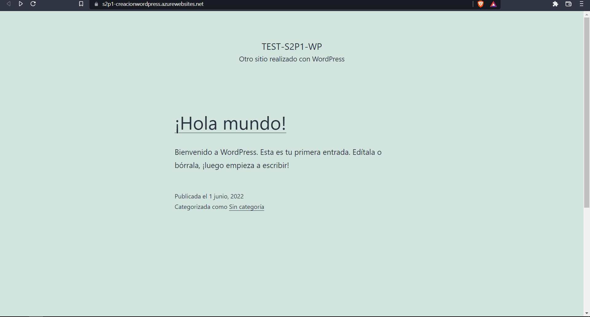

# **WordPress desde Azure**

En esta práctica aprenderemos a crear una página de [WordPress](https://wordpress.com/es/) visible, conectada desde un servidor con la ayuda de la plataforma de [Azure](https://azure.microsoft.com/es-mx/) de la empresa de Microsoft.

 

-------------------------
## **Requisitos**
-	Tener Un navegador instalado puede ser Google, Brave, Microsoft Edge.
-	Tener Windows/Linux/Mac.
-	Acceso a internet.
-	Suscripción de Azure.

## **Cosas para tener en cuenta**
-	WordPress es un PaaS.
-	Esta App Service nos va a cobrar por hora desde que se inicia. (Para desactivar el cobro hay que apagar el App Service)
-	MYSQL nos va a cobrar por hora desde que se inicia. (Para desactivar el cobro hay que apagar el MYSQL Service)
-	MYSQL una vez apagada  se vuelve a encender después de un plazo de 7 días

---------------------------
## TUTORIAL
**1.- Lo Primero que tenemos que hacer es dirigirnos al portal de [Azure](https://portal.azure.com/?l=en.es-mx#home) y buscar la sección de marketplace como se muestra a continuación:**

**2.- Una vez dentro de Marketplace buscamos en el buscador de Marketplace y buscamos WordPress y lo seleccionamos:**

**3.- Dentro de la App Service “WordPress” seleccionamos el plan WordPress y le damos en Crear.**

**4.- Ahora vamos a darle unas configuraciones a nuestra App Service.**
**Para crear un recurso de Azure tendremos que mínimo tener lo sig. completado:**

- Suscripción
- Grupo de Recursos
- Región
- Un Nombre

Una vez sabiendo esto podemos rellenar los espacios que tenemos como se muestra a continuación:

**En etiquetas podemos dejarlo en blanco ya que estas no son obligatorias para la creación de la App Service. Las etiquetas sirven para**: 

- Sacar reportes de costos.
- Cumplir normativas de seguridad.
- Para dar mas información para quien use Azure.

**A continuación, pasamos al apartado de revisar y crear dando clic como se muestra:**

Si todo aparece correctamente le daremos en Crear:

**5.-Una vez creado el App Service nos dirigimos al grupo de recursos y se nos mostrara la siguiente ventana(Aquí abrimos el link de nuestra página web en este caso https://s2p1-creacionwordpress.azurewebsites.net/):**

**6.-Una vez abierta la página se nos va a abrir la instalación de WordPress donde tendremos que rellenar los sigs. datos:**

Si todo marcha bien y haz seguido los pasos se mostrará la sig. ventana que nos dice que se ha completado exitosamente:

**7.-Seleccionamos el botón de acceder y nos pedira nuestras credenciales,  se las proporcionaremos y finalmente nos deberia mostrar nuestra pagina creada desde Azure con WordPress**

