# **En esta practica aprenderas a como ejecutar [Python](https://www.python.org/) desde la nube de [Azure](https://portal.azure.com/signin/index/)**
   

## **Requisitos**
- Tener una suscripción en Azure
- Tener conexión a internet
- Tener instalado un navedor puede ser Google, Brave, Microsoft Edge, Firefox (El de tu preferencia).
- Tener S.O. Windows/Linux/Mac
-------
## **Cosas a tener en cuenta:**
- El servicio de Compute Instances de Azure cobra por hora (Recuerda desactivarlo si no lo estas usando ya que como quiera se hará el cobro)   
- Puedes programar desde VS Code si usted lo deseá.
------

### **1.- Primero nos dirigimos al Portal de [Azure](https://portal.azure.com/#home) y buscamos en el buscador Azure Machine Learning**
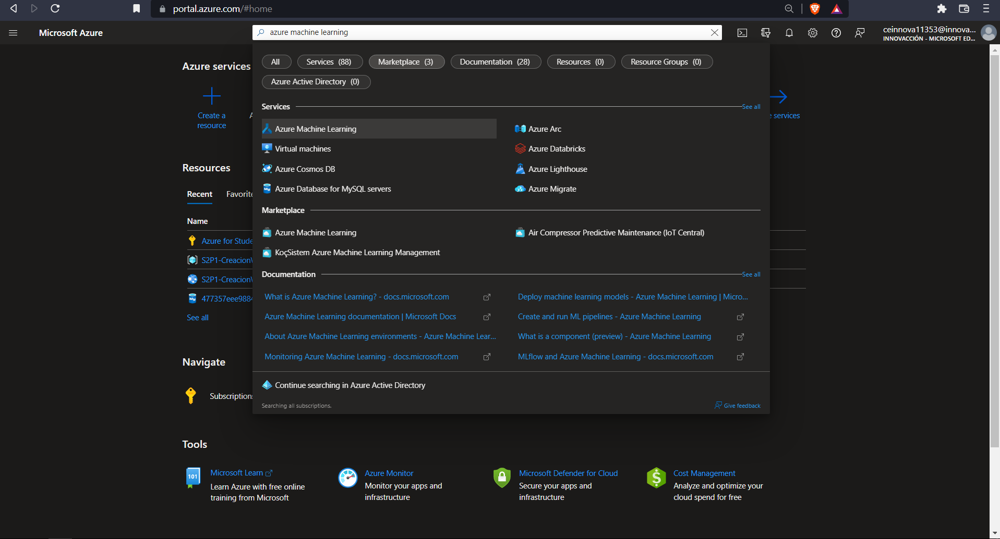

### **2.- Creamos uno nuevo en "+Create"**
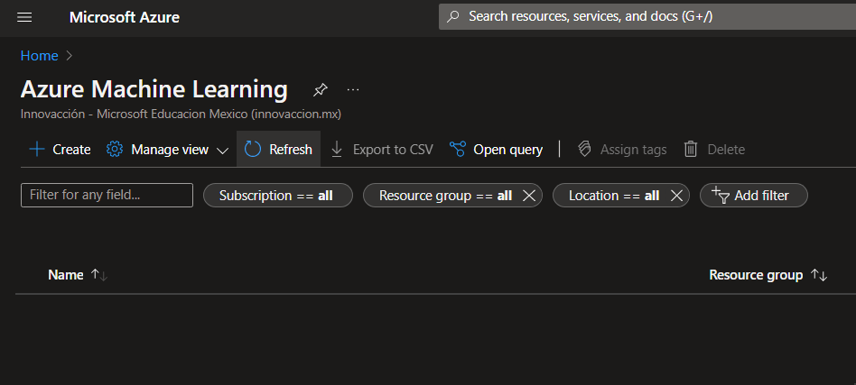

### **3.- En Basics llenamos la configuracion recuerdá que para crear un recurso lo minimo que tenemos que tener es:**
- Suscripción
- Grupo de Recursos
- Región
- Un Nombre

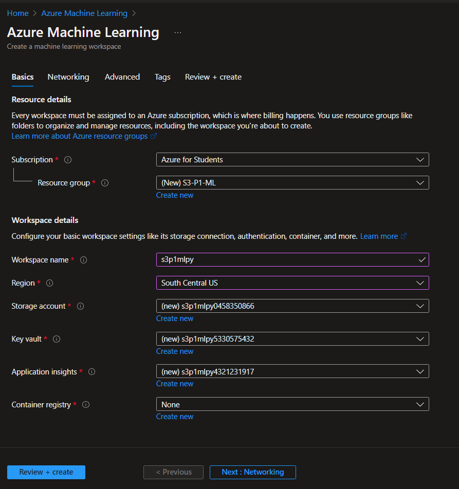

### **4.- Le damos en "Review + Create" y Azure empezara a checar que todo este correcto, si esta correcto te aparecerá lo siguiente:**
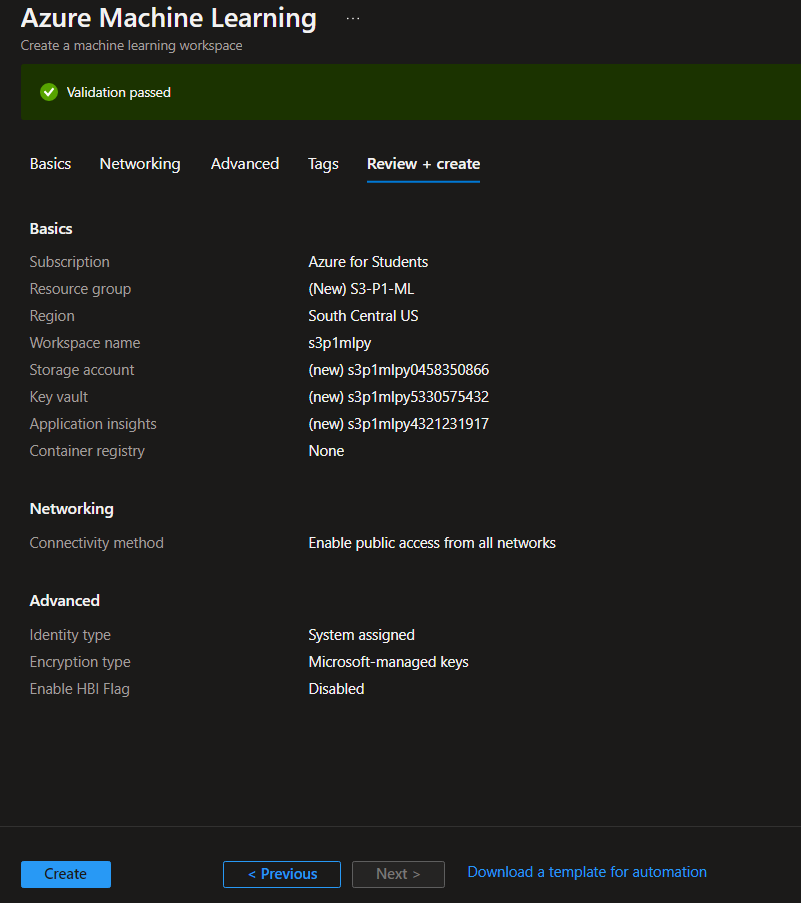
- Le daremos en create
  
### **5.- Una vez presionado el botón de Crear nos mandara a la siguiente pagina donde podremos ver nuestro recurso presionando el boton de "Go to source".**
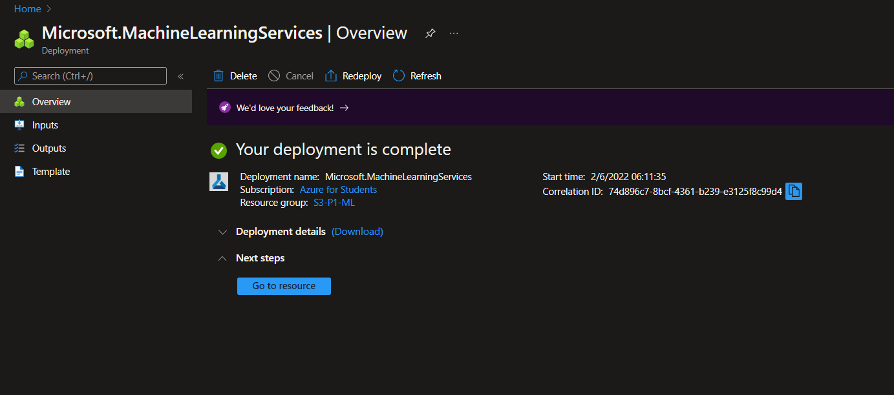

### **6.- Ahora nos dirigimos al [ML Azure](https://ml.azure.com/home) y nos vamos a nuestro grupo de recursos creado osea la area de trabajo en este caso es s3p1mlpy**
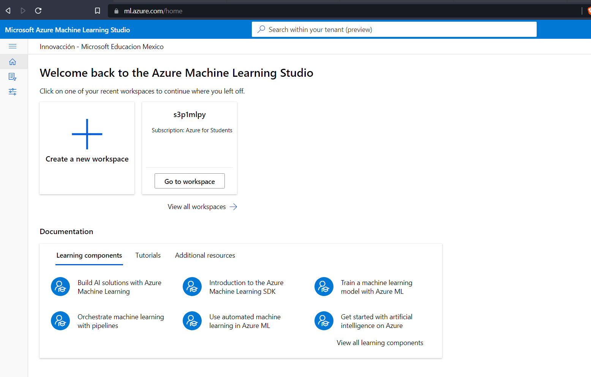

### **7.- Una vez dentro de nuestra area de trabajo vamos a Procesos en la interfaz de la izquierda que se nos despliega.**
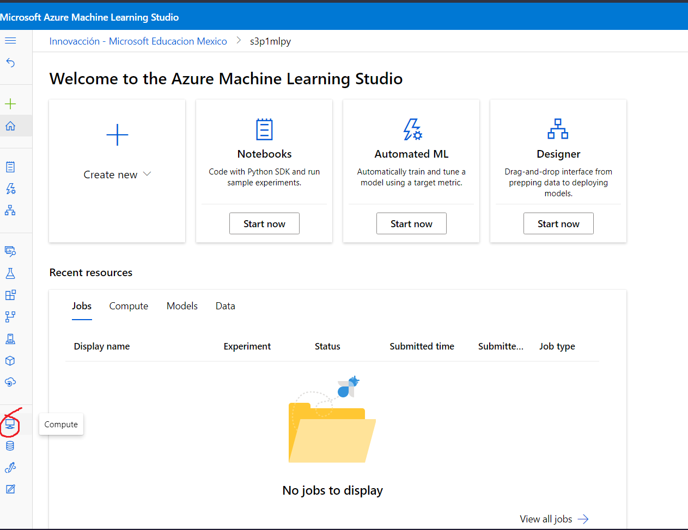

### **8.- Una vez dentro de Procesos vamos a Compute Instances y creamos uno nuevo en + New.**
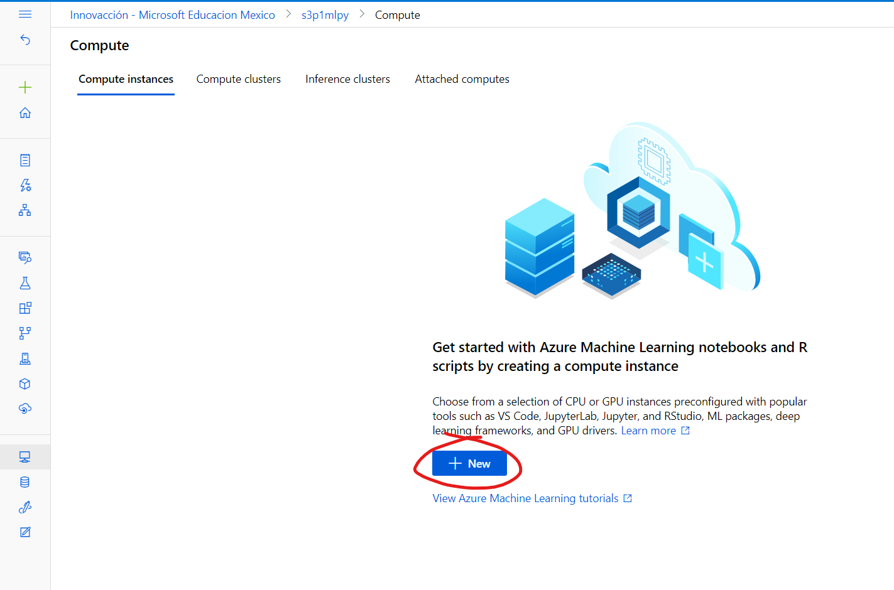

### **9.- Aqui adentro llenamos la configuración que nos pida un nombre de la computadora, escogemos preferentemente para esta practica CPU, seleccionamos opciones recomendadas y escogemos la virtual machine que nosotros deseemos en este caso practico se escogió ***"STANDARD_DS11_v2"*** y le damos a CREATE**.
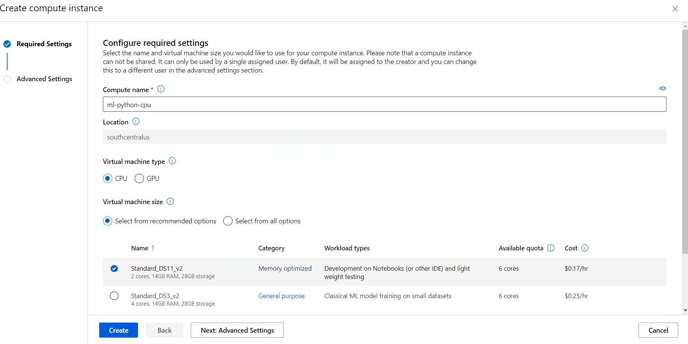

### **10.- Una vez creado se nos mostrara la siguiente interfaz donde nuestra virtual-machine empezara a ponerse en curso, esperamos hasta que nos salga como a continuación.**
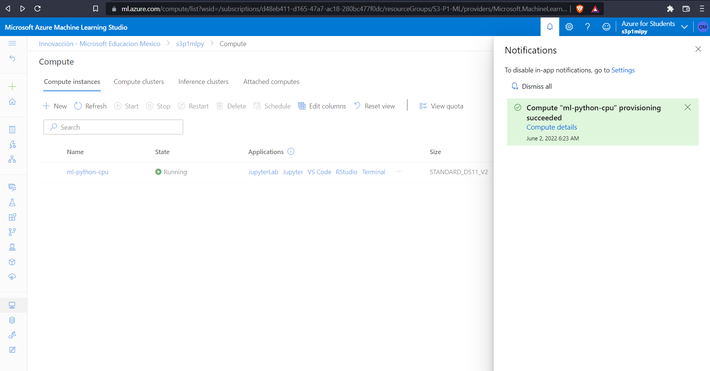

### **11.- Una vez completado el proceso nos vamos a la interfaz de la parte izquierda de nuestro navegador y nos vamos a notebooks**
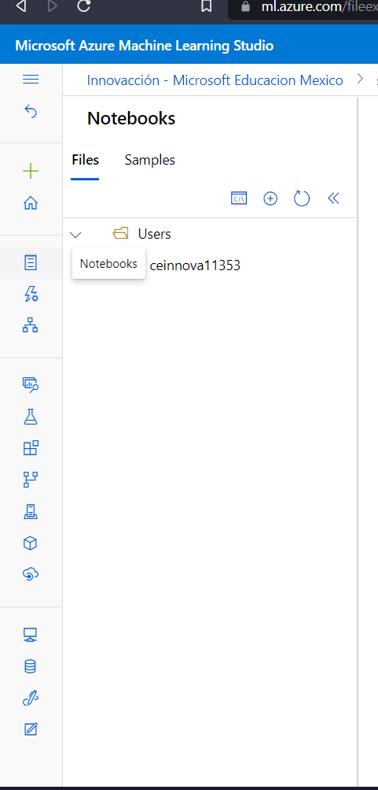

### **12.- En esta sección creamos un nuevo archivo**
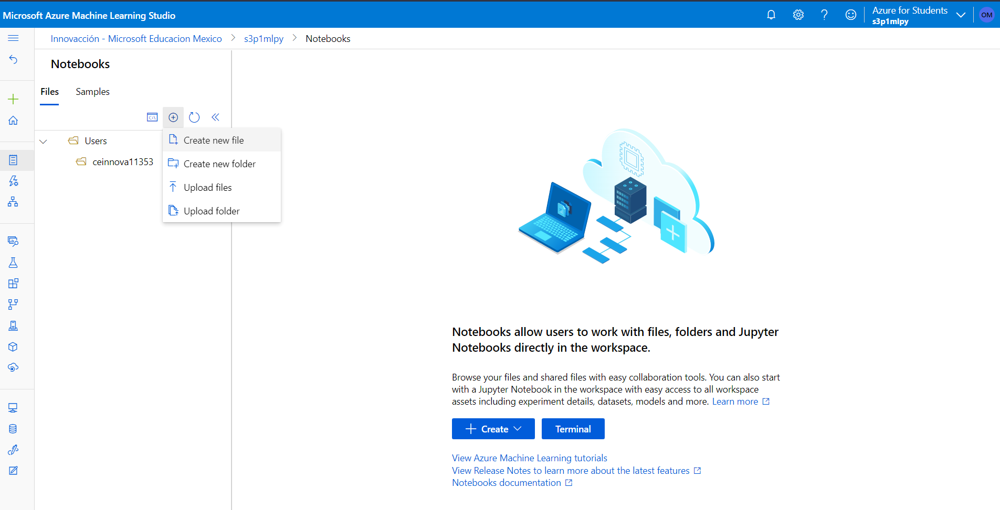

### **13.- Nos saldra esta interfaz donde llenamos la configuración que nos pida como el nombre del archivo y el tipo de archivo en este espacio colocaremos "Notebook.ipnb" IMPORTANTE que este termine en .ipnb ya que esta practica es para usar el lenguaje de Programación Python en Azure.**
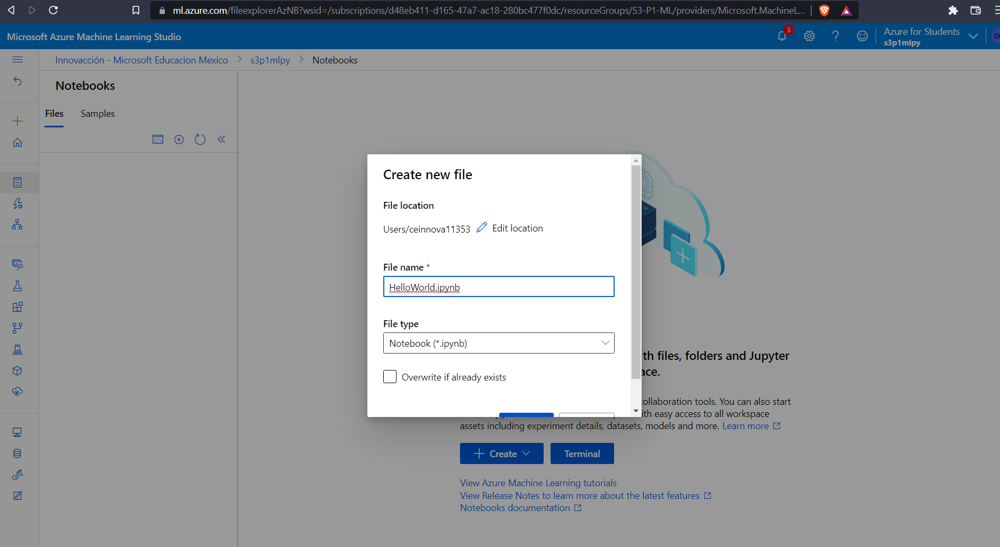

### **14.- Hecho lo anterior nos colocamos dentro del archivo que hayamos creado como nombre en este caso "HelloWorld" y creamos un sencillo programa que nos mostrara un texto , esto nos ayudará a saber si esta funcionando correctamente nuestro notebook con nuestra virtualmachine, si nos ha salido exitosamente nos mostrara el texto de abajo lo que hayamos escrito dentro de la funcion print.**
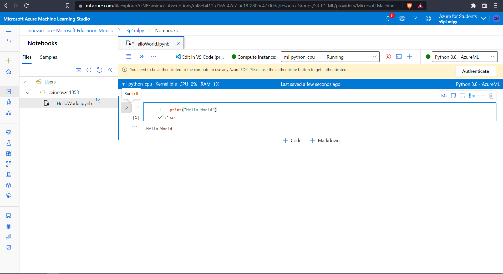

### **15.- También podemos abrirlo desde VS Code.**
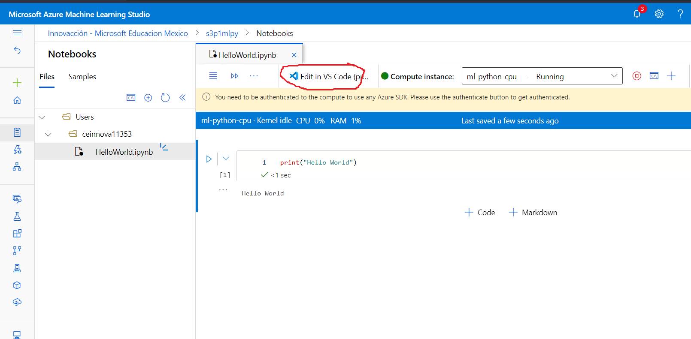

### **16.- Una vez abierto nuestro VS CODE se nos empezara a descargar una serie de extensiones que nos ayudara a conectarnos a la nube de Azure, si es la primera vez que hacemos esta conexión nos pedira la sesion de azure que hayamos creado esta practica una ves ingresada nos mostrara lo sig.:**
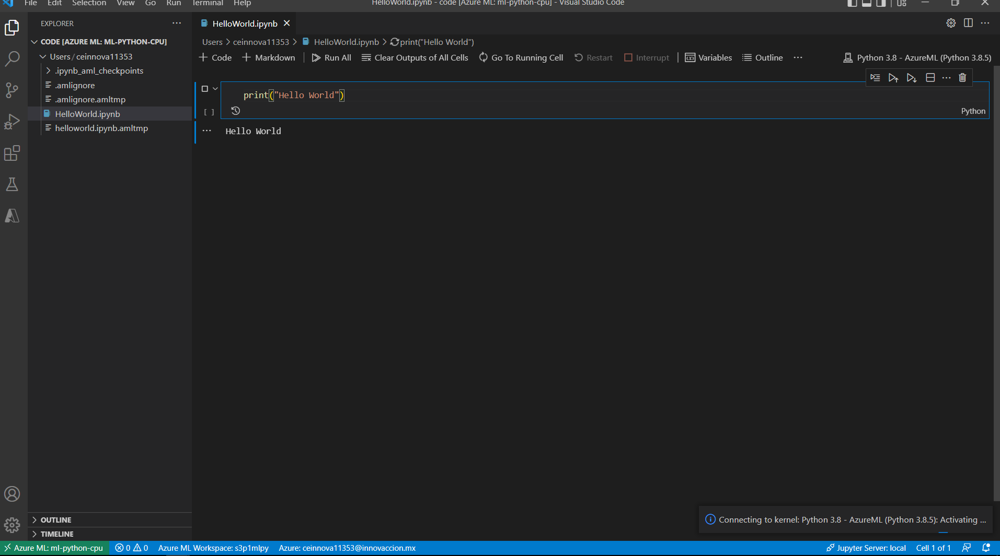

### ***!!Y Listo!! ya podemos ejecutar código de Python desde la nube de Azure sin necesidad de descargar ningun programa :D***

