# **Como conectar una Pagina web a un servidor con Azure**

## **En esta practica aprenderas con un App Service de [Azure](https://portal.azure.com/#home), conectar tus archivos a un servidor en la nube de Azure.**

---------
## **Requisitos:**
- Saber lo basico de git.
- Tener una cuenta de github.
- Tener SO Windows/Linux/MAC.
- Tener Conexión a internet.
- Tener una suscripcion en Azure.
- Tener un template hecho en php/html/nodejs etc. (Puedes usar este como ejemplo/Test)
----------
## **Cosas a tener en cuenta:**
- La App Service te cobra por hora.
- Azure App Service es un PaaS.
-----
## **Creditos**
TITLE: 
Foodee - One Page Responsive Free HTML5 template

AUTHOR:
DESIGNED & DEVELOPED by FREEHTML5.co

Website: http://freehtml5.co/
Twitter: http://twitter.com/fh5co
Facebook: http://facebook.com/fh5co

CREDITS:

Bootstrap
http://getbootstrap.com/

Bootstrap DateTimePicker
https://github.com/Eonasdan/bootstrap-datetimepicker

jQuery
http://jquery.com/

jQuery Easing
http://gsgd.co.uk/sandbox/jquery/easing/

Modernizr
http://modernizr.com/

Google Fonts
https://www.google.com/fonts/

Icomoon
https://icomoon.io/app/

Simple Line Icons
https://github.com/thesabbir/simple-line-icons

Respond JS
https://github.com/scottjehl/Respond/blob/master/LICENSE-MIT

animate.css
http://daneden.me/animate

jQuery Waypoint
https://github.com/imakewebthings/waypoints/blog/master/licenses.txt

Stellar Parallax
http://markdalgleish.com/projects/stellar.js/

Demo Images:
http://pexels.com

Icon Images Hand-drawn
handdrawngoods.com/store/tasty-icons-free-food-icons/

--------------------
## **TUTORIAL**
### 1.- El Primer paso que tendremos que hacer es dirigirnos al portal de [Azure](https://portal.azure.com/#home) y buscar en el buscador App Services y lo seleccionamos
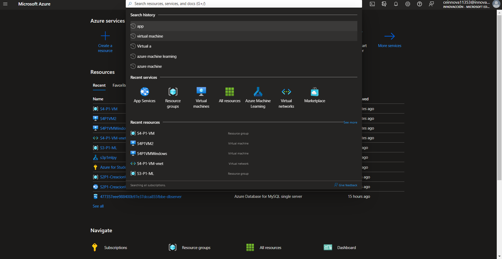

### 2.- Ahora nos llevara a esta interfaz donde crearemos nuestra app services como se muestra a continuación.
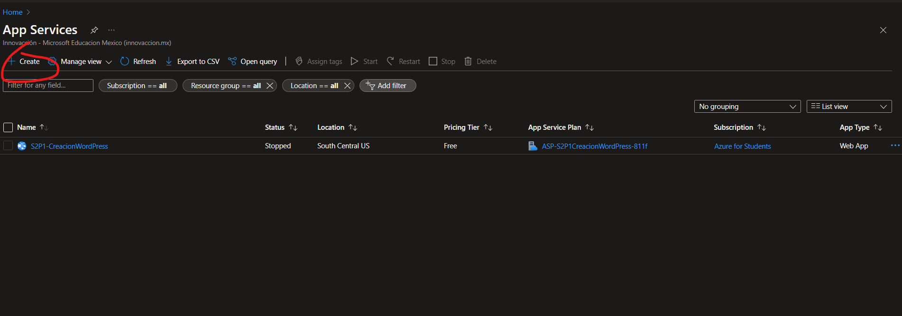

### 3.-Ahora pasamos a las configuraciones de la App Services. Recuerda que para poder crear un recurso se necesita lo minimo:
- Suscripción
- Grupo de Recursos
- Región
- Un Nombre

Sabiendo esto podemos rellenar los datos que nos pide como lo muestra a continuación, recuerda que seleccionamos en que lenguaje esta hecho nuestro template es importante saber esto y la region de la App Service.
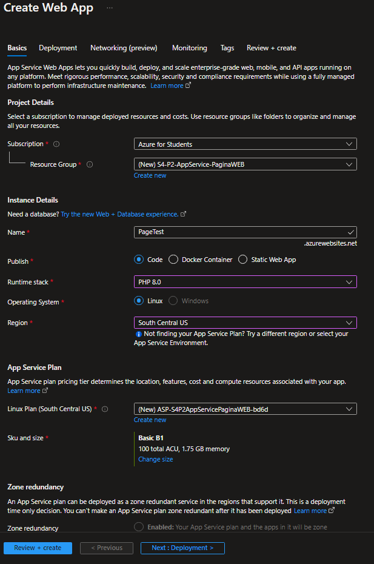

### 4.- Seleccionamos el plan que queremos; Nos colocamos en Sku and Size y presionamos Change size. Donde aqui podremos cambiar de plan y escalar nuestro App service , Para efectos de practica seleccionaremos 1GB memory con 60 minutos free.
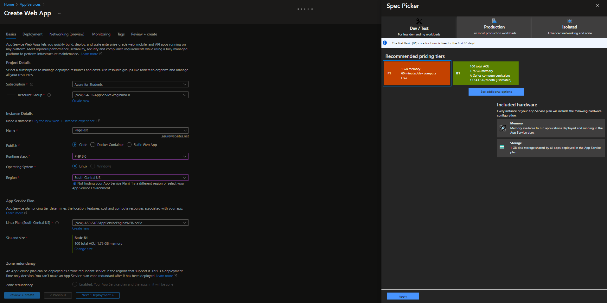

### 5.- Ahora el siguiente paso es revisar nuestra configuracion en el apartado de Review + Create.
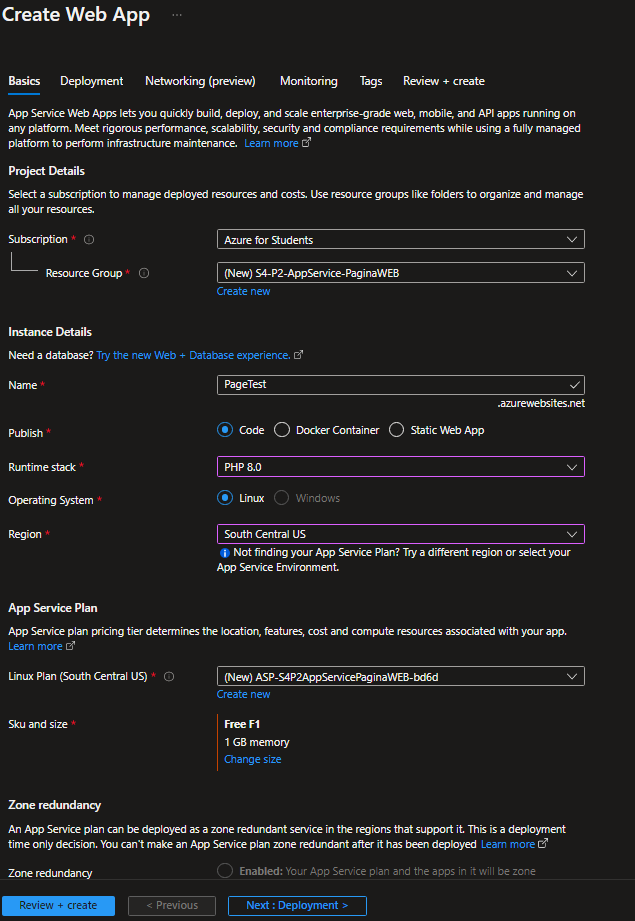

### 6.-Cuando haya terminado este proceso nos saldrá algo asi:
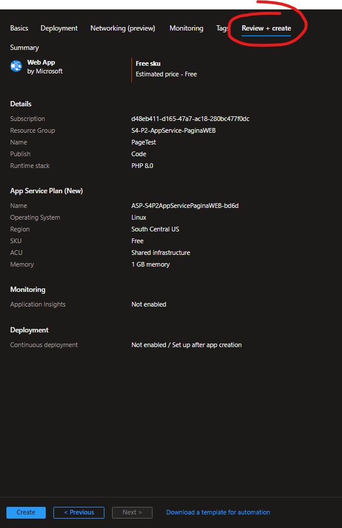

### 7.- Una vez creado el App Service tenemos terminado la parte de Azure, ahora tendremos que crear un repositorio en GitHub y dejar nuestros archivos de la pagina web, como ejemplo usaremos estos:
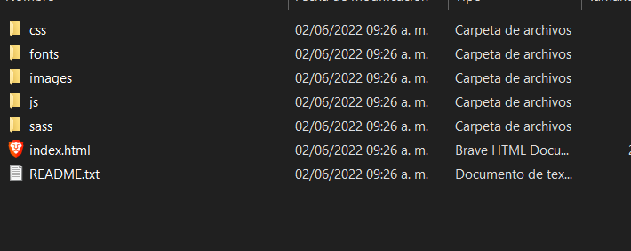

### 8.- Hacemos el proceso de subida de archivos a github al repositorio desde la carpeta que tenemos los archivos de la pagina web.
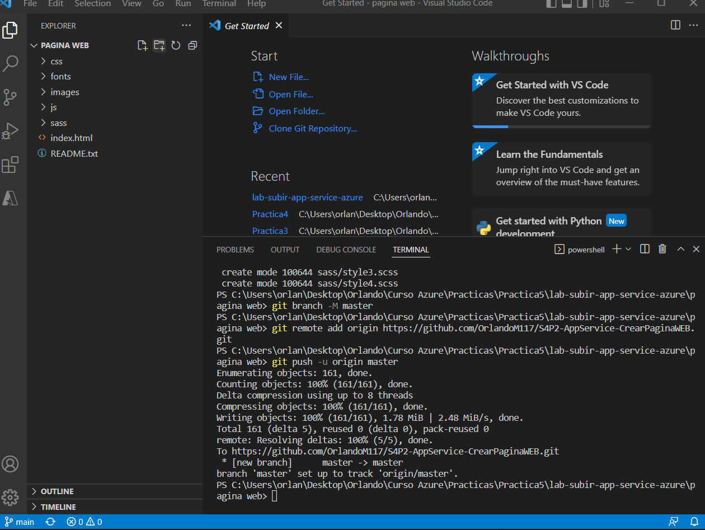

### 9.- Ahora nos pasamos de nuevo al portal de Azure y nos dirigimos a nuestra App Service, en la parte de la izquierda nos saldran estas opciones seleccionamos Deployment Center:
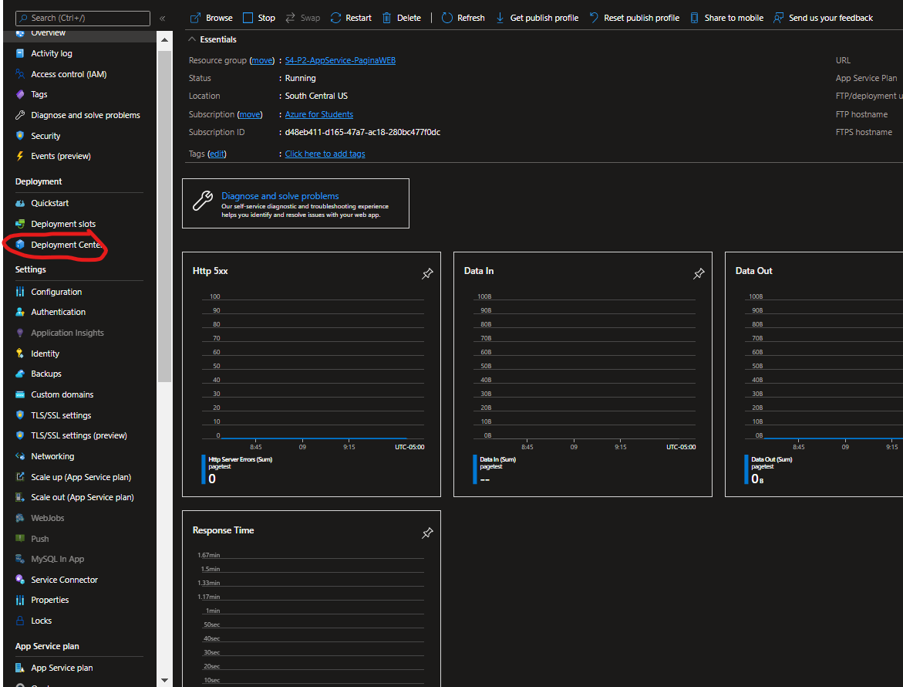

### 10.- Ahora seleccionaremos github en Fuente:
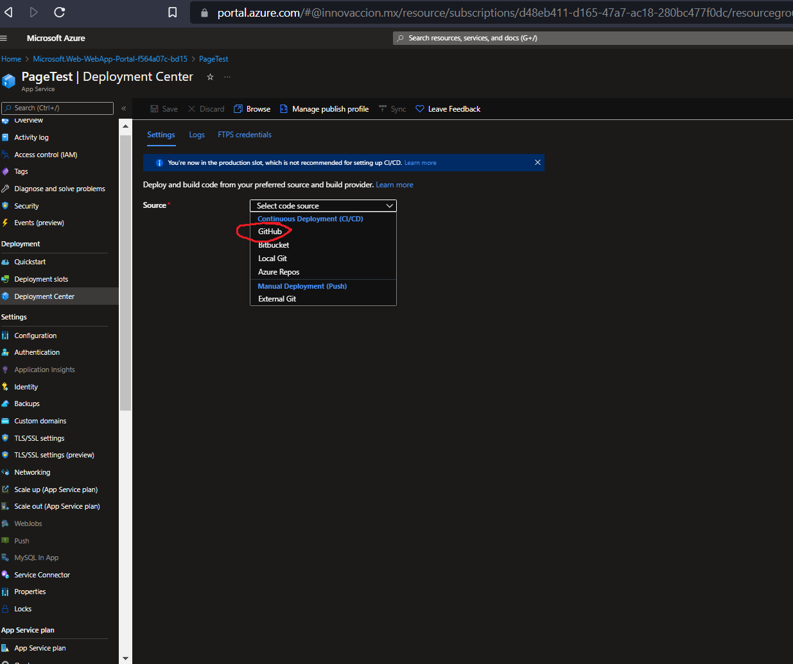

### 11.- Ingresamos nuestras credenciales de GitHub y le damos permiso
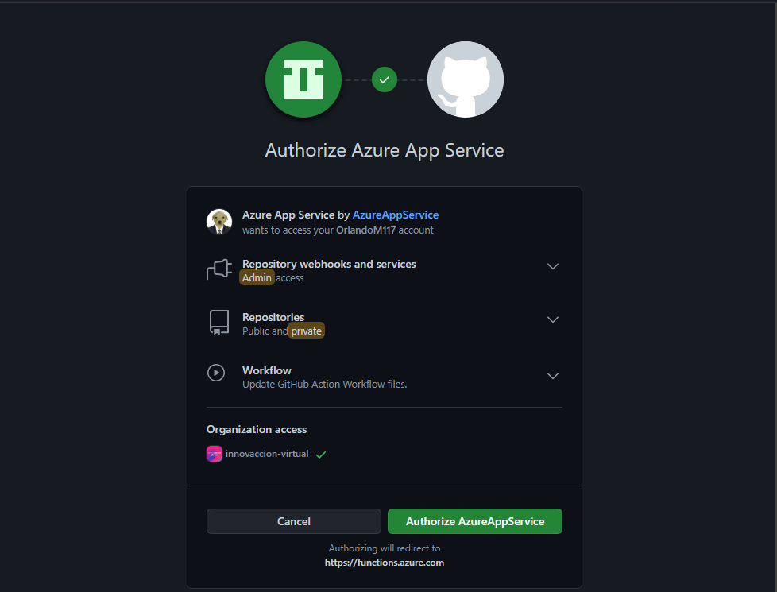

### 12.- Ahora nos saldrán estos nuevos espacios para rellenar donde en Organización pondremos en la que estemos en este caso "OrlandoM117", en Repositorio es importante poner la que creamos anteriormente, en Branch ponemos master (en algunas ocasiones suele ser main o master) y finalmente le damos al botón de guardar de arriba.
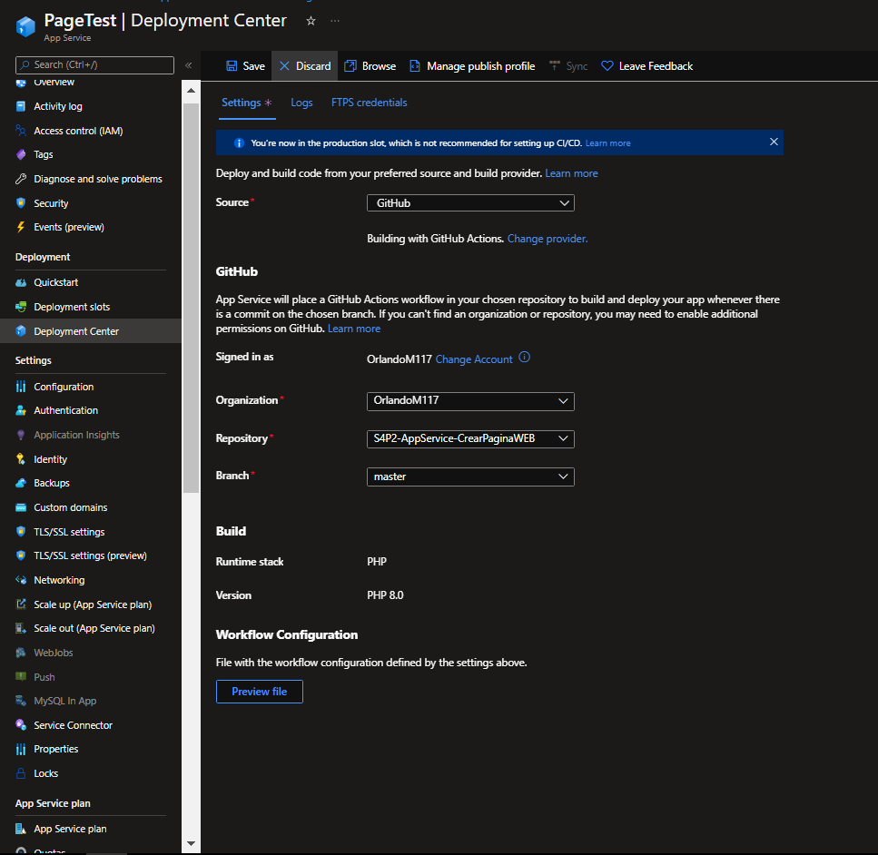

### 13.- Ahora nos vamos al link que nos proporciono el resource de AppService que creamos y se nos mostrara la pagina finalmente!!
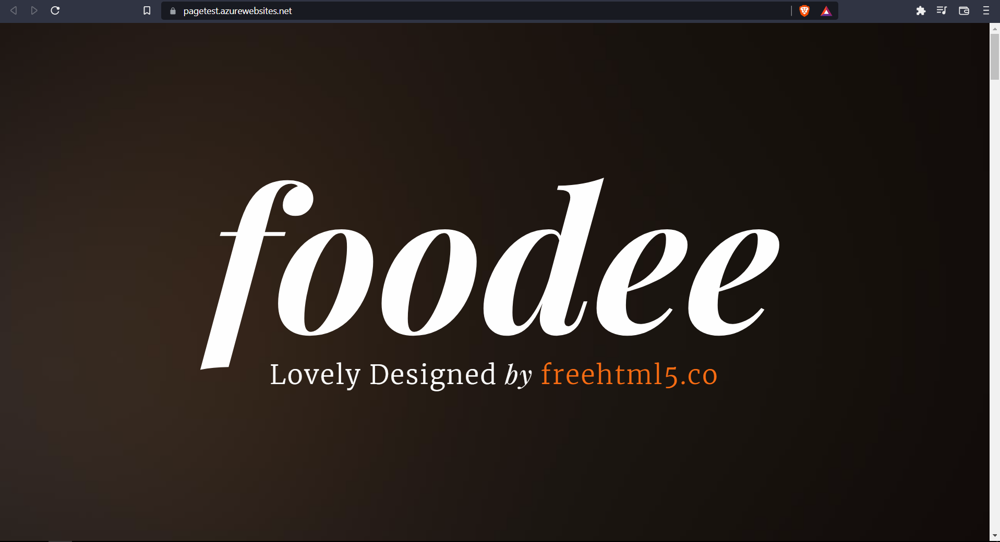

