# **Como hacer un function app desde [Azure](https://azure.microsoft.com/en-us/).**

**En esta practica verás hacer un function app desde la plataforma de [Azure](https://azure.microsoft.com/en-us/).**

------------
## Requisitos
- Tener una suscripcion en Azure
- Tener conexión a internet
- Tener un navegador instalado (Brave,Google, el de tu preferencia)

## Cosas a tener en cuenta:
- Azure Function App cobra por evento/transacción
- Azure Function App es un Paas - Serverless (Sin servidor)

--------
## TUTORIAL

**1.- Ingresamos al portal de [Azure](https://portal.azure.com/#home) y en el buscador buscamos Function App y lo seleccionamos**
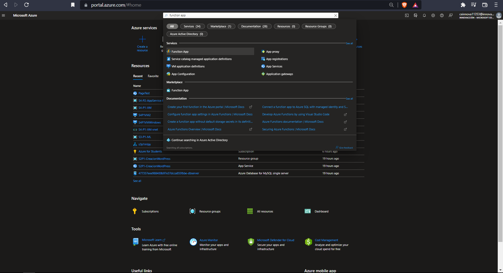

**2.- Una vez dentro tendremos la siguiente Interfaz creamos uno nuevo desde + Create**
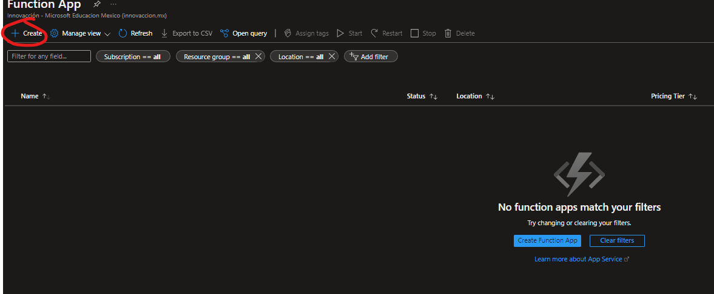

**3.- Ahora vamos a configurar nuestra Function app recuerda que para crear un recurso lo minimo que tienes que tener es:**
- Suscripción
- Grupo de Recursos
- Región
- Un Nombre
Sabiendo esto podras llenar los espacios que nos pide como mínimo.
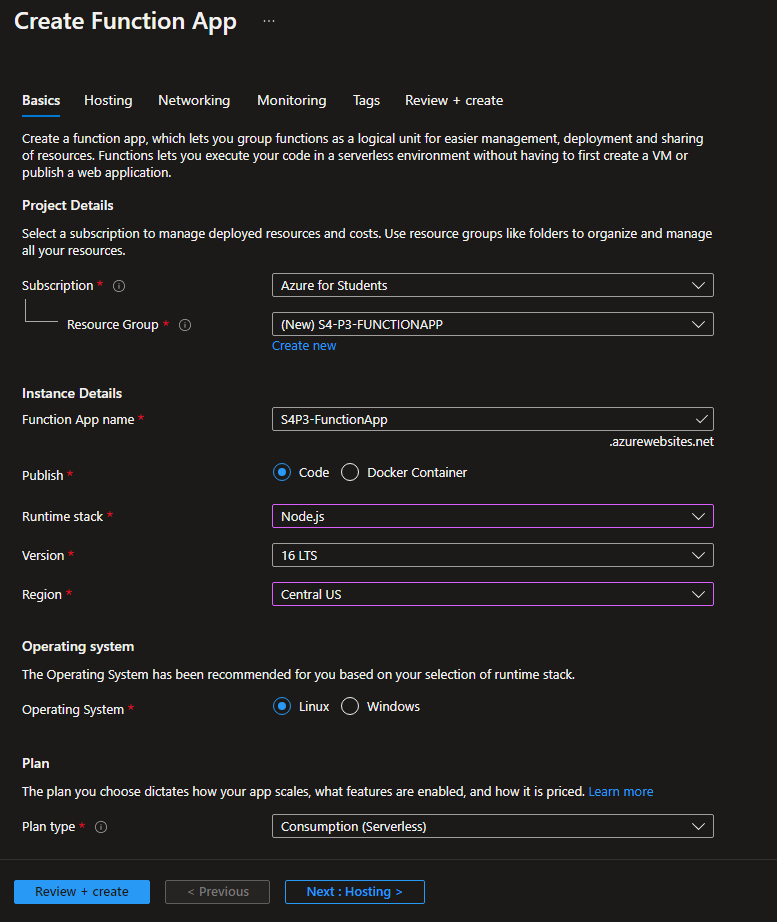
Es importante saber que podemos escojer entre si queremos contenedores o no, El tipo de sistema operativo, la región, el lenguaje a utilizar y sobre todo el tipo de plan ya que este va ser Serverless.

**4.- Le damos en revisar y crear para verificar que azure que todo este bien, una vez cargado que este bien le damos en el botón de create**
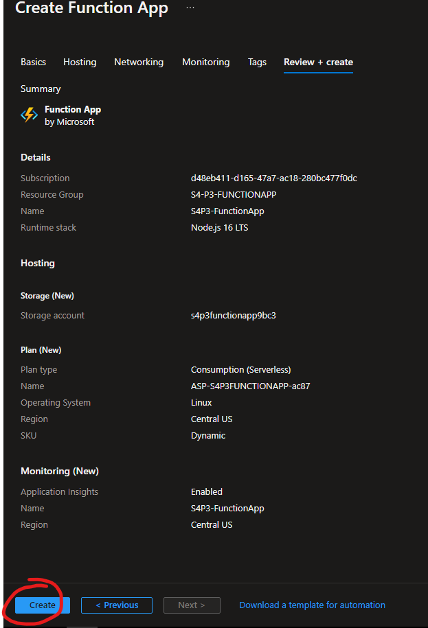

**5.- Esperamos a que se realice la implementacion una vez realizada deberia de verse asi, nos dirigiremos al resource**
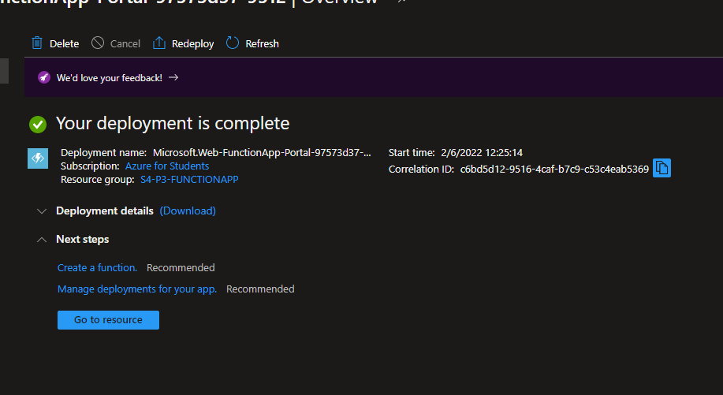

**6.- Ahora nos dirigiremos a la interfaz de la izquierda buscamos Functions y lo escogemos**
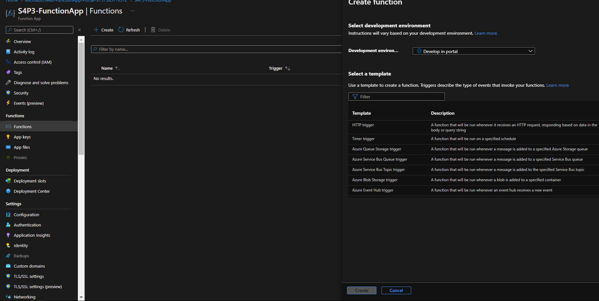

**7.- Ahora en este parte escogemos HTTP Trigger y le damos en crear**
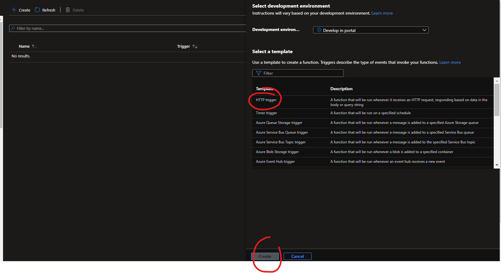

**8.- Una vez creado nos vamos a la interfaz de la izquierda y le damos en Codigo y Prueba**
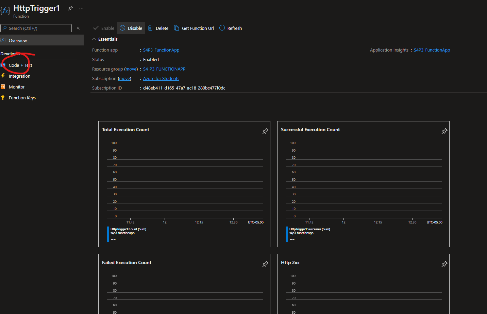

**9.- Aqui podemos modificar a nuestro gusto , en este caso practico le indicamos un nombre y le damos la bienvenida, lo podemos correr desde Test/Run y despues al botón de Run**
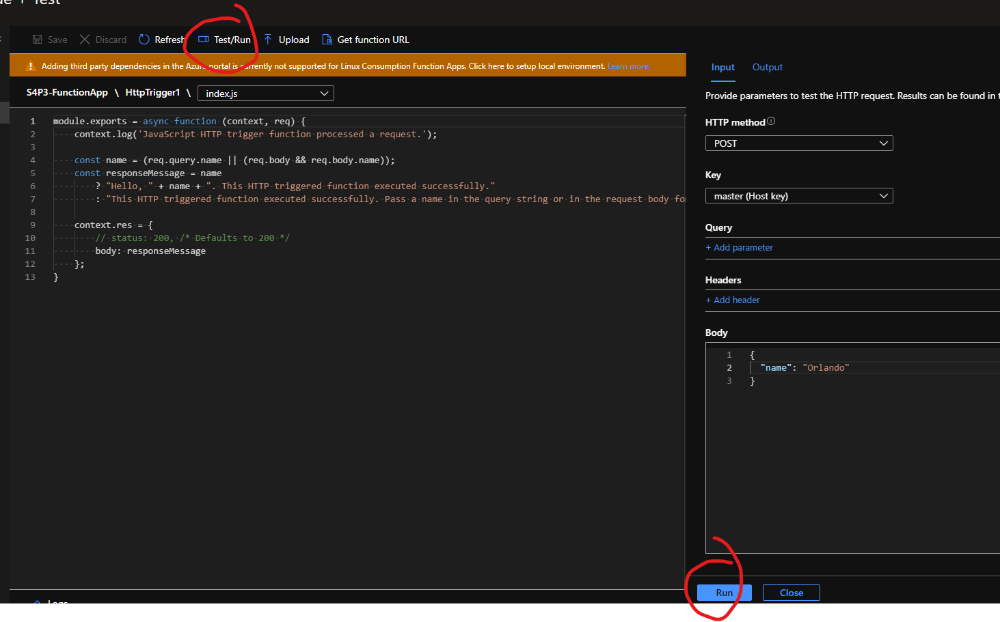

**10.- Ahora podrás ver el resultado de tu codigo**
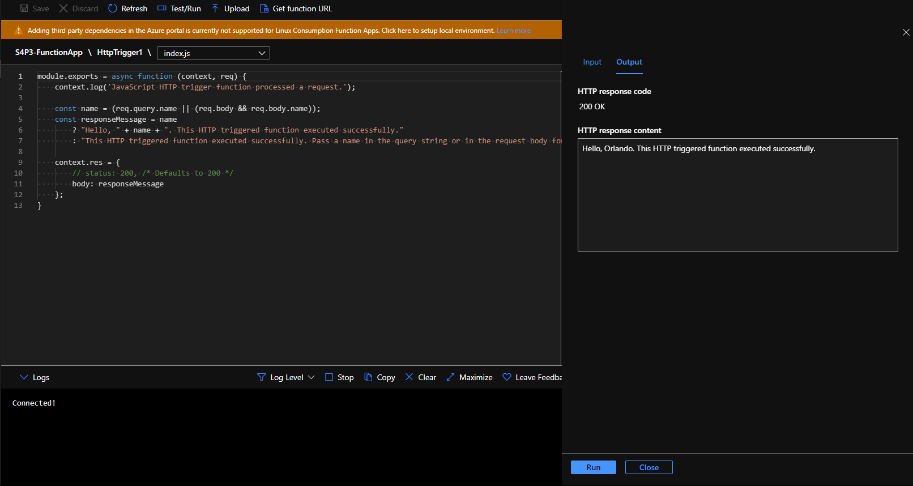 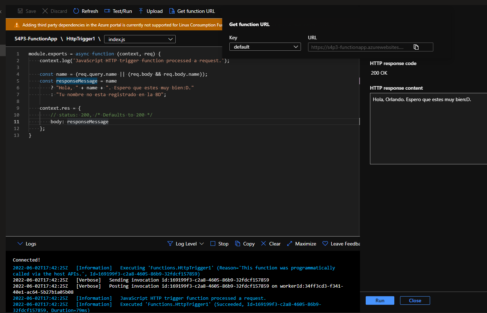

**11.- Si quieres probarlo como se vería nos vamos a function keys y copiamos la key para dirigirnos a esta [Pagina](chrome-extension://aejoelaoggembcahagimdiliamlcdmfm/index.html#requests).**
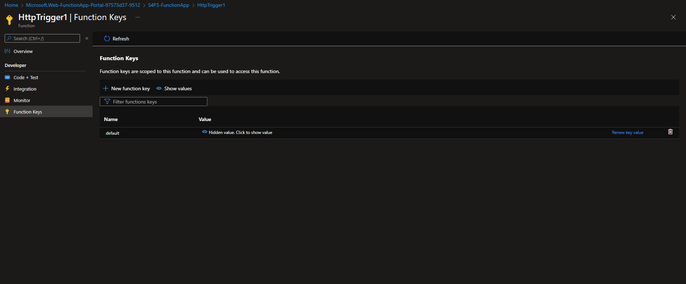

**12.- Instalamos la extensión para poder utilizar esta página, ahora tenemos que estar seguros de llenar los HEADERS como se muestra a continuación,agregamos uno nuevo header y ponemos x-function-key y despues la clave que copiamos, cabe recalcar que el link se coloca arriba. Ahora deslizamos en la pagina y le damos a send, y listo prueba hecha con exito!!**
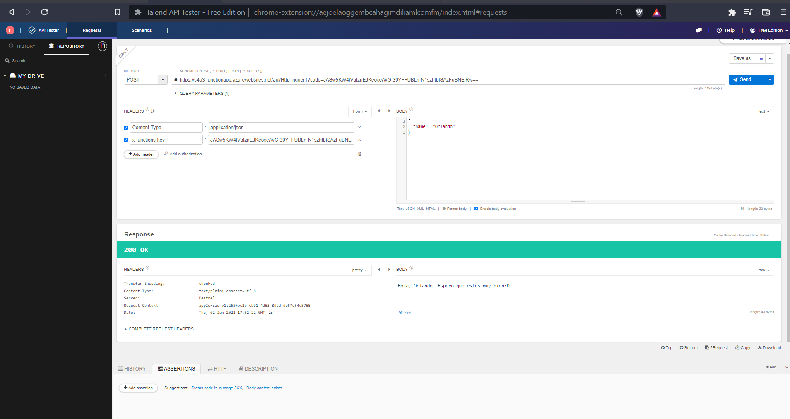

