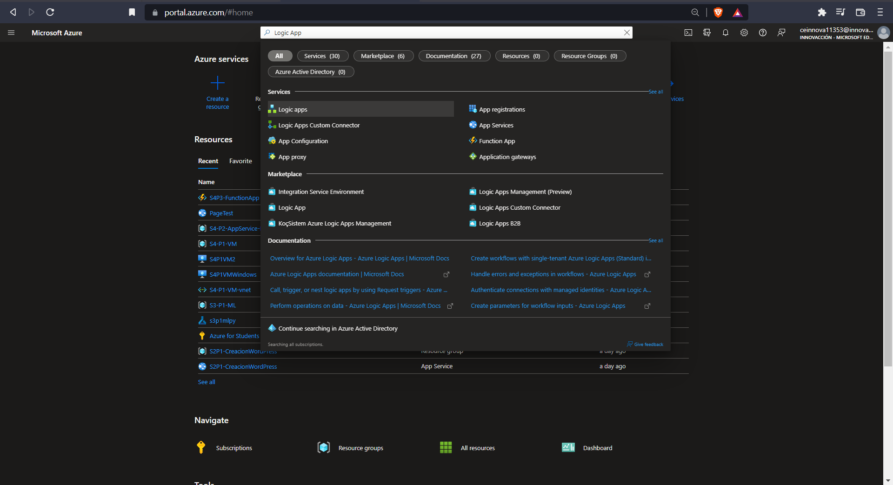

# Logic  App AZURE

**En  esta practica se verá a cabo como se utilizo un Logic App en Azure para analizar twits y colocarlos en una publicacion de un canal en teams**

----------------------
## Requisitos
- Tener una suscripcion en Azure
- Tener una conexión a Internet
- Tener un navegador instalado (Brave,Google, el de tu preferencia)

## Cosas a tener en cuenta:
- Azure Logic App cobra por evento/transacción
- Azure Logic App es un Paas

-------------------------
## Tutorial

**1.- El primero paso que tenemos que hacer es buscar el servicio de logic app, como se ve a continuación.**

**2.- El segundo paso que tenemos que hacer es crear uno nuevo**

**3.- Ahora tenemos que darle una configuracion a nuestra nueva Logic App recordemos que lo minimo que tiene que tener un recurso es:**
- Suscripcion
- Grupo de recursos
- Región
- Un nombre

**Ahora sabiendo esto es lo minimo tenemos que asignarle que sea Consumption**

**4.- Una vez hecho esta configuracion le podemos dar en revisar y ahora en crear**

**5.-Una vez dentro de la Logic App escogemos uno en blanco**

**6.-En esta practica como haremos un analizador de twits escogeremos Twitter**

**7.-Le ponemos un nombre a nuestra conexion y iniciamos sesion con nuestra cuenta de twitter**

**8.- En Search Text ponemos el text a buscar en nuestro caso va ser #IaWizards ponemos por el perodio que se tarde en analizar un twit**

**9.-Ahora añadimos un neuvo paso y buscarmos Azure Cognitive**

**10.-Escogemos Sentiment(V3.0) aunque esto puede variar (se escogio por la practica a realizar)**

**11.-Aqui nos va pedir una url y una contraseña para tener estos datos nos vamos al portal de azure y buscamos Cognitive Services**

**12.-Aqui escogemos Cognitive services multi-service account y le deamos en createa**

**13.-Recordando que es lo minimo que debe de tener un recurso sabemos que debemos colocar y solamente escogemos el Standard S0 (No importa la region)**

**14.-Le damos en revisar y en crear**

**15.-Dentro del cognitive Service creado nos vamos a la interfaz de la izquierda y escogemos keys and endpoint y copiamos la primera key y la url para copiarlas en donde nos pedian estos datos anteriormente**

**16.-Le damos un nombre a la conexion ponemos las credenciales que nso piden y le damos en create**

**17.-Aqui adentro le damos la Tweet id en documents id y Tweet text en documents text y le damos en añadir paso**

**18.-Aqui le damos que los datos se guarden o se vayan capturando en un google sheets donde lo podemos buscar en el buscador y seleccionarlo**

**19.-Aqui le damos en insert row osea insertar fila**

**20.-Iniciamos sesion con nuestra cuenta de google**

**21.-Una vez iniciado sesion con nuestra cuenta en file le damos el archivo a capturar y en worksheet le damos en que hoja**

**22.-Ahora se nos desplegara las columnas(Si no te aparecen borra y vuelve a crear el google shet) en este apartado aparecen las columnas que tenemos en nuestro excel en este caso son estas y le damos todos en check**

**23.-Ahora le darmeos los parametros de Twitter a cada una de nuestras columnas (preferentemente que tenga coherencia con lo que pusimos)**

**24.-Añadimos un nuevo paso dentro del anterior y ahora escogemos Microsoft teams en este caso postear en un canal**

**25.-Aca Ponemos el bot, el posteo se realizara en un canal, en que equipo y en que canal, ahora ponemos el mensaje y en este caso utilizarmos los parametros tweet text y tweeted by**

**27.-Ahora lo guardamos y ya lo podemos correr para comprar que funcione**

**28.-Como podras ver esta corriendo el recurso**

**29.-Ahora si twiteamos con el hastagh #IaWizards y revisamos en nuestra google sheet een nuestro google drive podremos ver el resultado de nuestro tweet**

