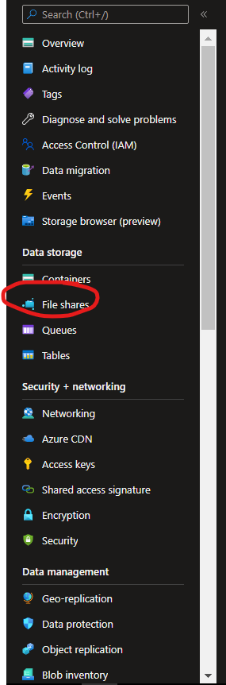

# Practica9.
**En esta practica se vera como crear un Storage Account en Azure y como crear un container/blob storage, file storage, queue y tablas todo esto dentro del Storage Account que crearemos(Es necesario crear un storage account para poder crear estos recursos).**

--------------
## Recursos.
- Tener una suscripcion.
- Tener conexion a internet.
- Tener instalado un navegador (Brave,Google,Firefox, etc).

--------------
## Cosas a tener en cuenta.

--------------
## TUTORIAL.

**1.-Primero creamos un storage account**

**2-Ahora le damos la configuracion a nuestro storage account (Es importante saber que para crear un recurso lo minimo que tenemos que tener es -Una region, -Una suscripcion, -Un nombre, -Un grupo de recursos**

**3.-Aqui podemos ver los tipos de redundancia, escoge el mas adecuado para ti (En esta practica escogeremos la LRS)**

**4.-Ahora nos vamos a networking y permitimos que este el acceso publico a todas las redes**

**5.-Ahora le damos en revisar y en crear y creamos el storage account**

**6.-Ahora nos vamos al recurso**

### CONTAINERS/BLOB STORAGE
**7.-Ahora lo primero que haremos en crear un CONTAINER/BLOB STORAGE**

**8.-Le damos un nombre y que el acceso sea Container(anonymous read acces) y lo subimos**

**9.-Ahora probemos en cargar un archivo en Upload y seleccionando el archivo de nuestro windows con la interfaz de la izquierda**

**10.-Ahora podras ver que se subio el archivo y si lo seleccionamos nos mostrara lo siguiente podemos copiar la url y ver la imagen**

**11.-Aqui se puede ver el archivo que subimos (en este caso fue la imagen de un perrito)**

**12.-También podemos subir paginas estaticas a nuestro blob storage seleccionado web static en la interfaz de la izquierda y activando al opcion como se muestra a continuación**

**13.-Activando esta opcion nos mostrara los siguientes recuadros donde podremos poner el nombre de nuestra pagina**

**14.-Ahora nos regresamos a nuestro container y se nos creara un $web ahi podemos subir nuestros archivos de nuestra pagina web estatica como lo hicimos con la imagen del perrito, y si copiamos la url del archivo podemos visualizarlo o si queremos ver todo en conjunto copiamos la url de la interfaz static web podremos visualizarlo**

### FILE STORAGE

**15.-Para crear un file storage nos vamos a file shares en la misma cuenta de almacenamiento(storage account)**

**16.-Creamos uno nuevo, le ponemos un nombre el tipo de tier (en este caso le pondremos optimized-el basico) y lo creamos**

**17.-Ahora adentro del file storage podremos subir archivos dandole a upload y seleccionando el archivo desde la interfaz de la izquierda y subiendolo**

**18.-Aqui se podra ver tu archivo, en este ejemplo practico subí un archivo en .py llamado "holamundo"**

**19.-Si le damos click derecho encima de cualquier archivo lo podemos editar**

**20.-Como podras ver a continuación**

**21.-Ahora si queremos conectar este file storage a nuestra computadora e ir subiendo archivos mucho mas facil desde nuestro sistema operativo le damos en Connect y seleccionamos nuestro sistema operativo y copiamos el codigo que nos muestra a continuación**

**22.-Abrimos un PowerShell o Cmd y pegamos el codigo le damos enter despues de pegarlo**

**23.-Ahora como podras ver se nos muestra en nuestro equipo un disco extra que es el file storage y ahi podremos arrastrar los archivos para ir pegandolos mas facil o abrirlos desde ahi**

### QUEUE
**24.-Ahora para crear una queue nos dirigimos a la interfaz de la izquierda y seleccionamos queue (dentro desde nuestra storage account)**

**25.-Le damos un nombre a nuestra fila y la agregamos**

**26.-Desde nuestra queue podemos poner mensajes a cada uno, poner la expiracion o que nunca expire y le damos a ok para agregarlo a nuestra queue**

**27.-Como podras ver en overview se ven los mensajes de nuestra fila**

### TABLES
**28.-Ahora para crear tables nos dirigimos a la interfaz de la izquierda y seleccionamos Tables (recuerda que desde la misma cuenta de almacenamiento o si tu quieres crear otra cuenta de almacenamiento para crear una tabla)**

**29.-Aqui le damos un nombre a nuestra tabla y la agregamos le damos en OK**

**30.-Se muestran las tablas creadas pero para modificarlas tendremos que irnos a la interfaz de la izquierda y seleccionar storage browser(preview)**

**31.-Seleccionamos tablas y la tabla creada es usuarios la seleccionamos**

**32.-Aqui podremos ir añadiendo datos a nuestra tabla**

**33.-Como podras ver estos son los dos datos añadidos de mi tabla**

**FIN**

---------------------
