# Creacion de una Base de datos SQL desde Azure

**En esta practica verás como crear una base de datos relacion estructurada desde Azure Cloud shell**

-------------------
## Recursos
- Tener una suscripcion en Azure
- Tener conexion a internet
- Tener instalado un navegador (google,brave, firefox, etc)
- Tener creado una cuenta de almacenamiento para poder crear una Base de datos SQL Azure (Si no sabes como puedes ir a la practica 9 y ahi explico como)
- Para obtener los links y códigos de la practica dale click a [esto](https://github.com/josejesusguzman/acordeon-az900-innovaccion/blob/main/res/consultas-sql.md)

-------------------

## Cosas a tener en cuenta
- Por defecto del codigo la base de datos se creara desde un grupo de recursos random, para poder crear una base de datos sql desde un grupo de recursos 1.-Puedes modificar el codigo ó 2.-Puedes crear la base de datos sql desde el portal de azure buscandolo en el buscador.
- Las bases de datos SQL te cobran por hora aunque no la estes utilizando asi que es recomendable apagarlas si no se estan utilizando.

-------------------

## TUTORIAL

**1.-Abrimos Azure Cloud shell y lo primero clonamos el repositorio: tecleamos git clone "link"**
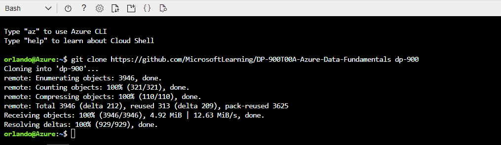

**2.-Ahora nos posicionamos en la carpeta con el sig comando:**
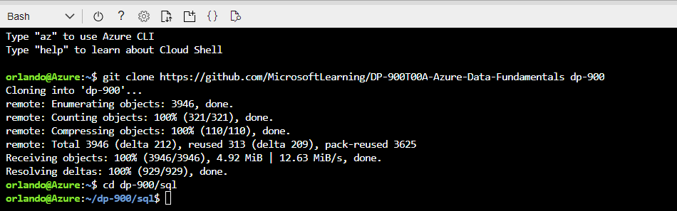

**3.-Ahora creamos la base de datos sql con el sig comando:**
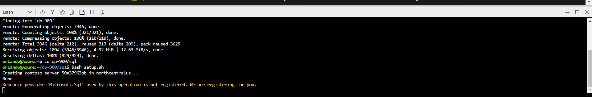

**4-Ahora le daremos las credenciales (estan en el link de recursos, en el repositorio de git)**
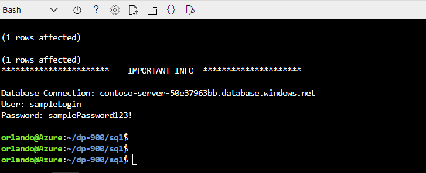

**5.-Ahora veremos que se ha creado en el grupo de recursos**
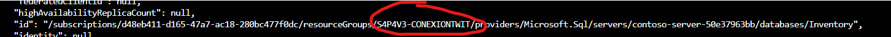

**6.-Nos vamos al recurso donde se haya creado, seleccionamos el SQL Database**
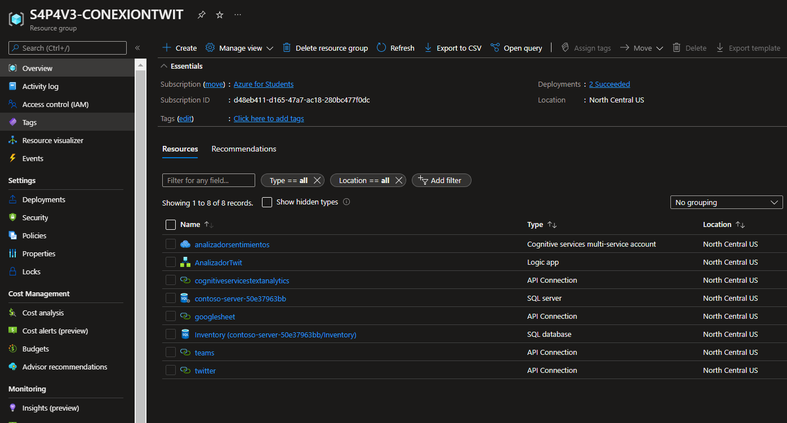

**7.-Ahora le daremos un firewall**
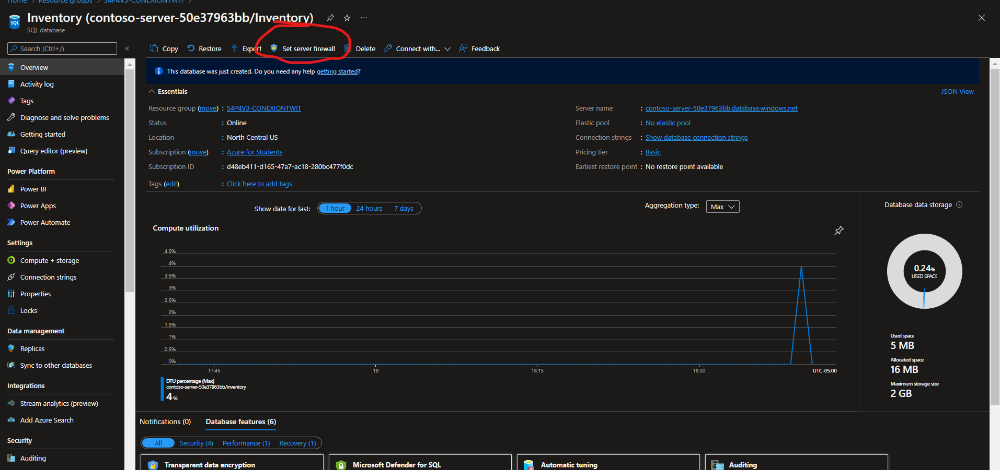

**8.-Añadimos un IPv4**
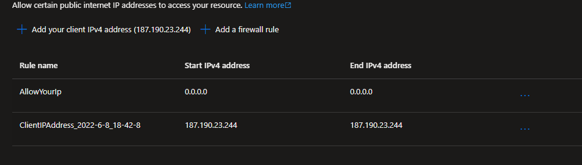

**9.-Y ahora nos vamos a la interfaz de la izquierda y seleccionamos query editor**
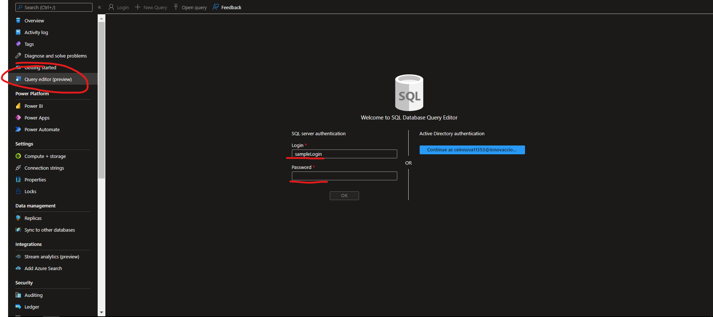

**10.-Copiamos las credenciales del repositorio de github y las pegamos donde estabamos en el query editor**
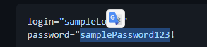

**11.-Ahora ya estamos adentro del query editor,Ahora podemos hacer consultas**
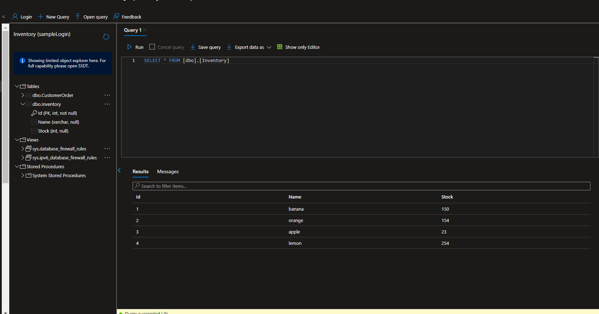

**12.-O ingresar datos**
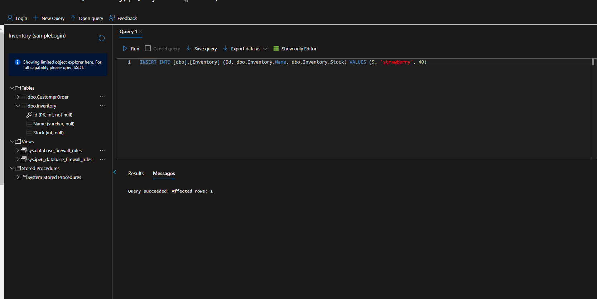

**13.-Y finalmente si seleccionamos la tabla se muestra los datos introducidos**
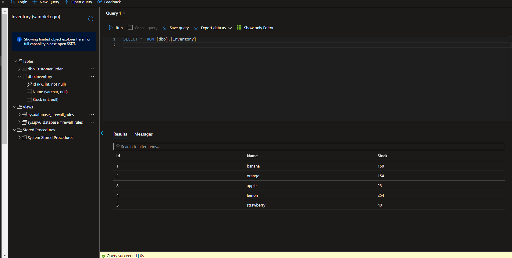

