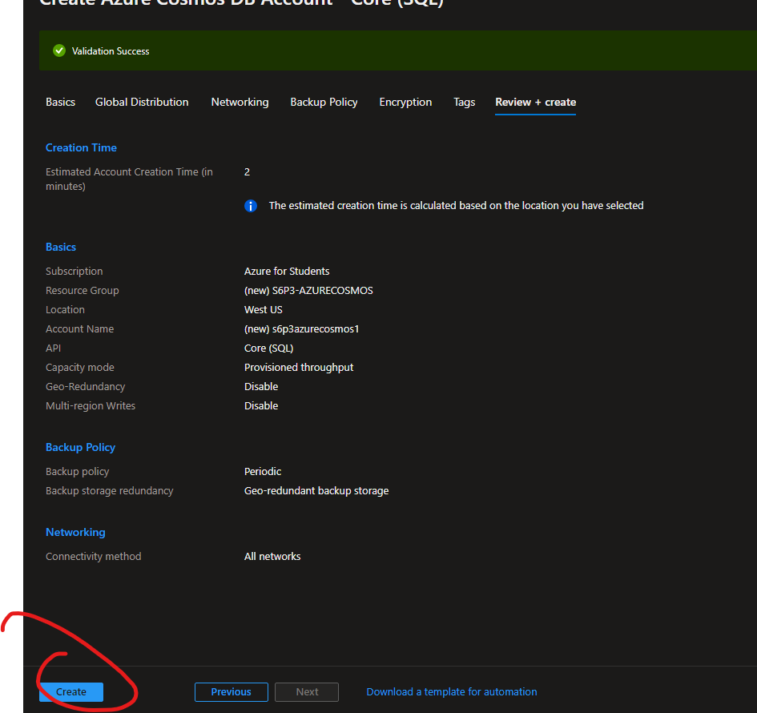

# Como crear una base de datos nsql AzureCosmos DB desde el portal de Azure

**En esta practica se vera a como crear una base de datos de azure cosmos nosql desde el portal azure y agregar items desde el explorador(Desde Azure)**

----------------
## Requisitos
- Tener una suscripcion en Azure
- Tener una conexion a internet
- Tener un navegador instalado (Brave,Google,Firefox, etc)
  
----------------
## Cosas a tener en cueta
- Las bases de datos que vamos a crear son NOSQL no relacionales
- Las bases de datos de Cosmos DB tienen un costo asi que recomiendo apagarlas si no se van a usar.
. Todas las bases de Datos son PaaS

----------------
## TUTORIAL

**1.-Buscamos Azure Cosmos y creamos uno nuevo**

**2.-Aqui nos daran a escoger en este caso para efectos de esta practica escogeremos la primera opcion como se ve a continuación**

**3.-Ahora configuraremos el recurso, para esto tienes que saber que lo minimo que te pide un recurso de azure para ser creado es: -Un grupo de recursos, -Un nombre, -Una region, -Una suscripcion**

**4.-Le daremos en revisar y en crear**

**5.-Nos vamos al recurso y nos posicionamos en la interfaz de la izquierda la opcion "Quick Start" y escogemos un lenguaje de programacion que estemos familiarizados a programar por ejemplo se escogera Node.JS, y luego le daremos,(Podemos descargar el archivo y programar desde ahi y luego subir el archivo a azure) o si no en crear un item podremos añadir los items desde el explorador**

**6.-Ahora abrimos desde el explorador la base de datos**

**7.-Dentro de nuestra base de datos creamos un nuevo item desde la interfaz de arriba en la opcion de "New item"**

**8.-Esto esta en .json, agregamos los datos a un item a la base de datos de Cosmos DB y le damos en guardar**

**9.-Si queremos otro item en nuestra base datos seguimos agregando en new item luego en save para guardar**

**10.-Ahora si queremos realizar una consulta, nos dirigimos como se muestra en la imagen y seleccionamos los datos como se muestran a continuacion se despliegan en la parte de abajo**

