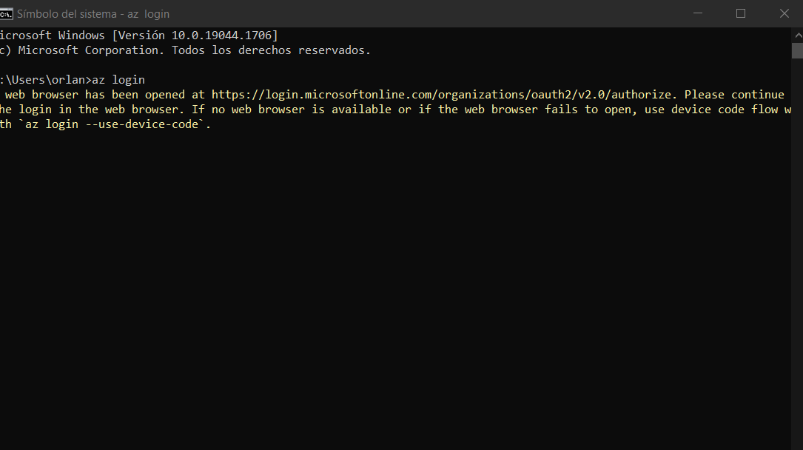
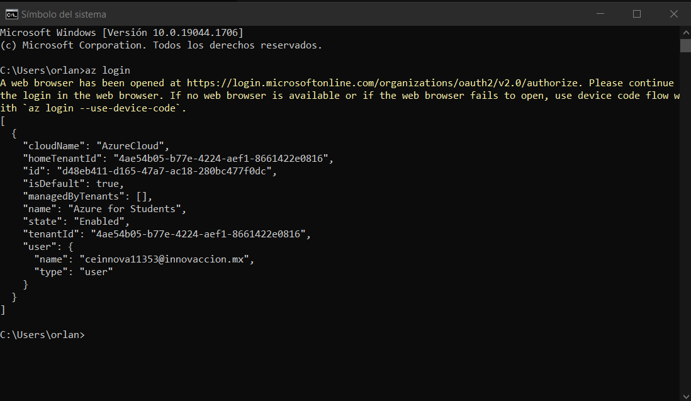
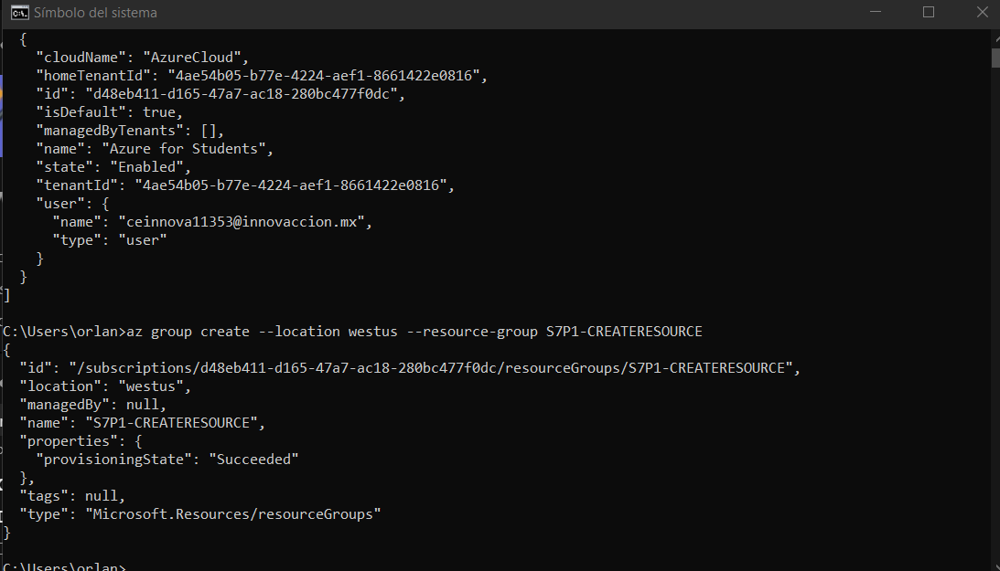
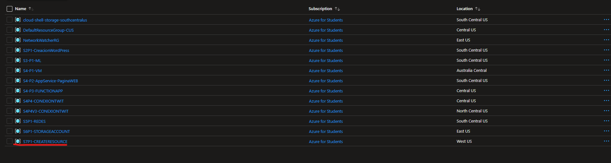

# Como crear un grupo de recursos desde Azure CLI

-------------------
## Requisitos
- Tener instalado AZURE CLI ---> [Click aqui para descargar](https://docs.microsoft.com/en-us/cli/azure/install-azure-cli)
- Tener una suscripcion en Azure
- Tener una conexion a internet
- Tener sistema operativo Windows/Mac/Linux NO ADMITE CHROMEBOOKS
-------------------
## Cosas a tener en cuenta
- Tienes que saber que el Azure CLI admite en Windows, Mac, Linux solamente
- El azure CLI se ejecuta desde una terminal (puedes usar cmd, powershell lo que tu quieras)

-------------------
## TUTORIAL

**1.- Abres una terminal (En este caso de practica es el cmd) y ejecutas el comando az login que nos sirve para logearnos con nuestra cuenta de azure**

**2.- Una vez ingresado se verá algo tal que asi**

**3.- Para crear un grupo de recursos tendrás que ejecutar el sig comando : (recuerda que en location tu puedes poner otra region y en --resourcegruoup puedes cambiar tu nombre del grupo de recursos) Con esto ya se creó el grupo de recursos**

**4.- Ahora si quieres comprobar que se haya creado nos vamos al portal de azure y como podrás ver ahi esta (Buscas el nombre que le hayas puesto)**

