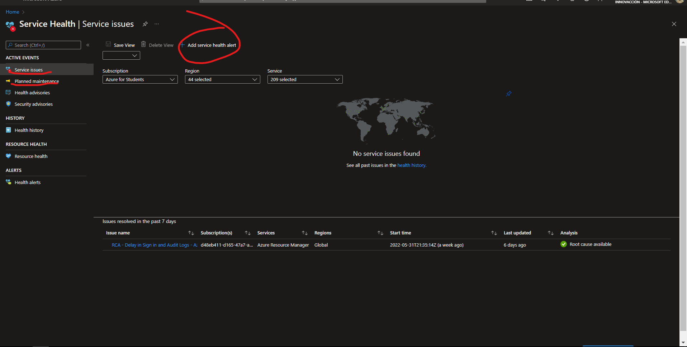

# Como crear un Service Health Desde Azure

**En esta practica aprenderas a crear un service health desde Azure**
------------------------
## Recursos
- Tener una suscripcion en azure
- Tener conexion a internet
- Tener un navegador instalado
  
-------------------------
## Cosas a tener en cuenta
- El service health nos ayuda para saber si un recurso de azure y/o servicio esta caído a nivel mundial o en una región
- Es totalmente gratis por consecuencia no tiene SLA
- Es un SaaS
  
-------------------------
## TUTORIAL

**1.-Primero buscamos en el buscador Service health y lo seleccionamos**

**2.-Ahora agregamos un servicio de health**

**3.- Aca seleccionamos la suscripcion, en que tipo de servicios, la región y el tipo de evento, Ahora que ya tenemos seleccionado esas caracteristicas le añadimos una accion**

**4.-Le damos a crear un grupo de acciones**

**5.-Le damos una suscripcion, el grupo de recursos, el nombre de la accion (En este tipo de recurso no ocupa la región ya que esta disponible en todo el mundo)**

**6.-Ahora nos vamos a notificaciones y seleccionamos como quiero que nos llegue la alerta y el nombre de la alerta (en este caso escogí por email) y le damos en ok**

**7.-Ahora le damos en revisar y despues en crear**

**8-Ahora volvemos donde estabamos ya que no teniamos acciones seleccionamos la accion que acabamos de crear**

**9.-Si seleccionamos la alerta y le damos en test action podremos testear la alerta**

**10.-Como podras ver nos llego la alerta al correo (es un test)**

**11.-Le damos un nombre a la regla, una descripción, el grupo de recursos y marcamos la opcion de abajo**

**Ya con esto nos va avisar con un email que esta pasando si se llega a caer el servicio o llega haber un servicio en mantenimiento**

**12.-Ahora tenemos mas pestañas del servicio de Service Health**

**13.-Tenemos tambien health advisores (aqui nos avisa el servicio de heatlh si un servicio esta caido)**

**14.-Luego tenemos la pestaña de Security y vemos si hay problemas de seguridad en los servicios**

**15.-En la pestaña de History podemos ver las caídas o mantenimientos que hubieron**

**16.-En la pestaña de resource health vemos el recurso**

**17.- Y por ultimo en alerts vemos nuestras alertas creadas**

