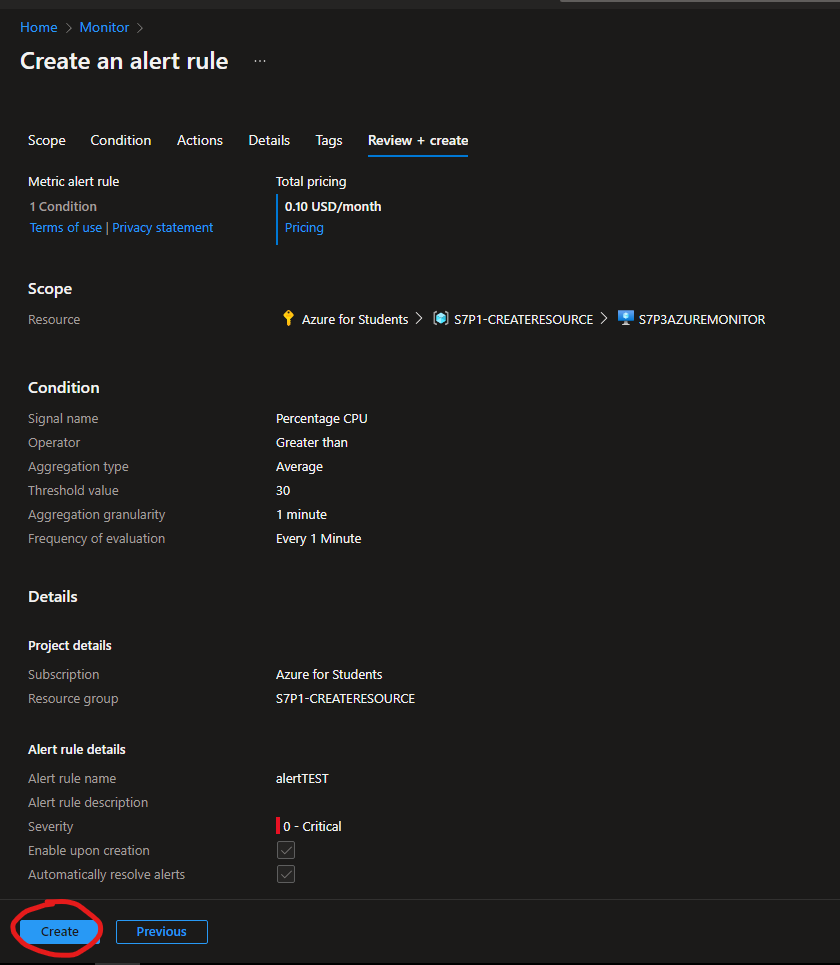

# Como crear Azure Monitor

**En esta practica veras como crear un Azure Monitor**
----------------
## Requisitos
- Tener una suscripcion en Azure
- Tener una conexion a internet
- Tener un navegador instalado (Brave,Google,Firefox, etc)
   
----------------
## Cosas a tener en cueta
- No tiene costo por lo tanto no tiene SLA
- Este es un servicio SaaS

----------------
## TUTORIAL

**1.-Buscamos en el buscador Azure Monitor lo seleccionamos y nos vamos a Metrics y seleccionamos el recurso que queramos supervisar el rendimiento y despues en apply**

**2.-Aqui podemos ver las metricas del recurso para estarlo checando**

**3.-Para crear una alerta en Azure Monitor, nos vamos a Alerts creamos uno nuevo y le damos en Alert Rule**

**4.-Dentro de la regla seleccionamos el recurso que queramos supervisar el rendimiento**

**5.-Despues de darle en Done le escogemos el tipo de la condicion, el promedio y cada cuando se analize esto**

**6.-Ahora nos vamos a Details, le ponemos un grupo de recursos, el tipo de severidad, el nombre y una descripcion**

**7.-Le damos en revisar y en crear**

**8.-Ahora para ver nuestra alertas nos vamos a alerts y luego alerts rules**

**9.-Y aqui estaran nuestras alertas creadas**

**10.-Seleccionamos la alerta y le damos una accion (esta accion esta creada, si quieres saber como se crean ve a la practica anterior a esta**

**11.-Y ahora testeamos que este funcionando y nos vamos a nuestro correo (En este caso es el correo que pusimos en la accion y la condicion que se nos envie un email) y vemos que ha funcionado**
