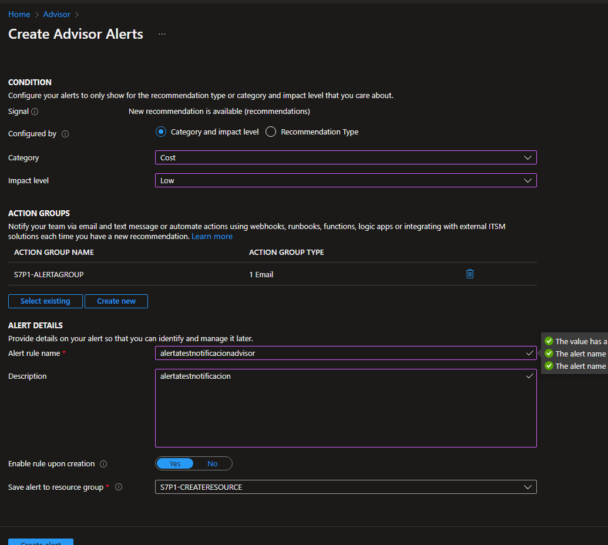

# Como crear un Azure Advisor

**En esta practica aprenderas como crear un Azure Advisor y utilizarlo**
----------------
## Requisitos
- Tener una suscripcion en Azure
- Tener una conexion a internet
- Tener un navegador instalado (Brave,Google,Firefox, etc)
   
----------------
## Cosas a tener en cueta
- No tiene costo por lo tanto no tiene SLA
- Este es un servicio SaaS

----------------
## TUTORIAL

**1.-Buscamos en el buscador del portal de azure y seleccionamos Advisor y como podras ver aqui estamos dentro de la interfaz de advisor y como estan nuestros recursos y que nos recomienda hacer**

**2.-Si queremos añadir alertas es tan simple como irnos a la interfaz de la izquierda seleccionamos "Alerts (Preview)" y ahora en New Advisor Alert**

**3.-Dentro de la alerta le configuramos que tenga una categoria, nivel de impacto, el nombre de la regla ,la descripción, y el grupo de recursos, (IMPORTANTE AGREGAR LA ACCION , ESTA ACCIÓN YA ESTA CREADA SI QUIERES SABER COMO CREAR ACCIONES VE LAS ULTIMAS DOS PRACTICAS)**
