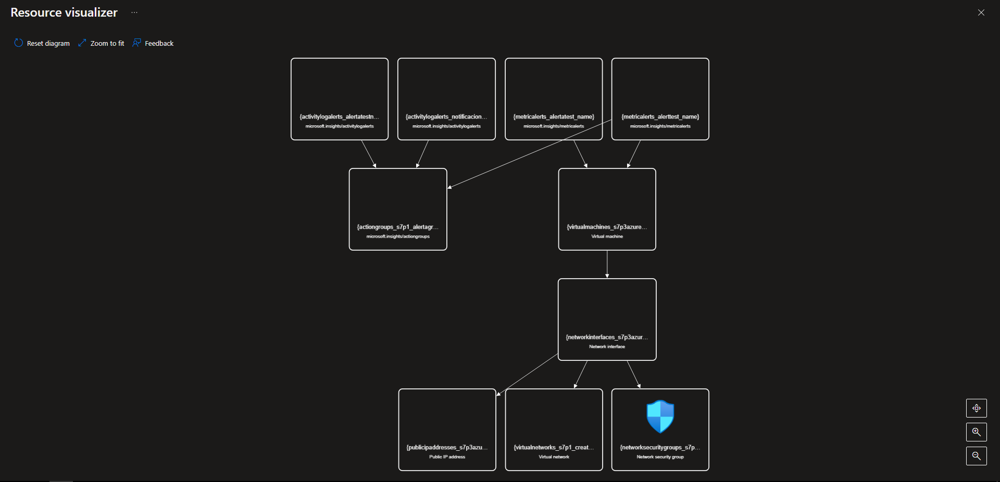

# Como crear una plantilla ARM en Azure

**En esta practica aprenderas como crear una plantilla ARM en Azure**
----------------
## Requisitos
- Tener una suscripcion en Azure
- Tener una conexion a internet
- Tener un navegador instalado (Brave,Google,Firefox, etc)
- Tener instalado la extension de Azure ARM en Visual Studio Code
- Tener instalado Visual studio Code
- Tener instalado Azure CLI
----------------
## Cosas a tener en cueta
- Ocuparas tener instalado Visual studio code (Puedes usar otra IDE si te permite agregar la extension)
- Ocuparas agregar la extension de Visual studio code (No es forzosamente necesario pero te ayudara a autocompletar la plantilla)
## TUTORIAL

**1.-Nos vamos a un grupo de recursos cualquiera o un recurso cualquiera**

**2.-Te desplazas por la interfaz de la izquierda y buscas Export Template**

**3.-Desde export template podemos ver un diseño grafico de como es que se realizo esta plantilla ARM o podemos tambien descargar el codigo de la plantilla arm**

**4.-Ahora nos vamos a nuestro visual studio code y escribimos el siguiente codigo para validar que tengamos el Azure CLI (es importante ponerlo dentro de un .json con el nombre azuredeploy**

**5.-Ejecutamos (en este caso cmd) con el sig: comando para validar que creamos bien el azuredeploy.json**

**6.-Ahora validado que esta correcto veras que dice Succeded en ProvisiongState**

**7.-Ahora creamos una plantila arm ejecutando de nuevo el mismo codigo (es necesario modificar el codigo en visual studio code, te dejo el codigo en el repositorio para crear un storage account en west us)**

**8.-Aqui estara ejecutandose**

**9.-Si lo hiciste bien se mostrara algo similar a esto**

**10.-Como puedes ver se creo la cuenta de almacenamiento**
