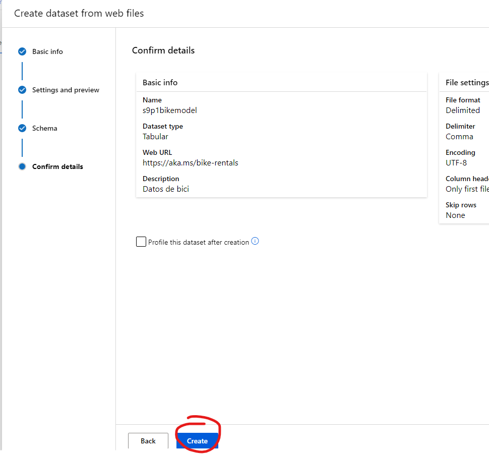

# AZURE - CREACION DE UN MODELO DE PREDICCION DE VENTA DE BICIS 

**En esta practica aprenderas como crear un modelo de prediccion con una base de datos .CSV**

## Requisitos
- Tener una suscripcion en Azure
- Tener una conexion a internet
- Tener un navegador instalado (Brave,Google,Firefox, etc)
- Ocuparas este [link](https://aka.ms/bike-rentals) para la base de datos si no funciona *(https://aka.ms/bike-rentals)*

## Cosas a tener en cueta
- Con el modelo que vamos a ver podremos saber cuanta cantidad de bicis se podrá vender (puedes subir cualquier base de datos pero teniendo las suficientes variables) en este caso sera para una predicción de bicis
- Recuerda que las compute instances cuestan por hora asi que no olvides apagarlas y/o eliminarlas 
- Los computer clousters no importa si no los eliminas ya que estos se apagan cuando no son utilizados (importante seleccionar los nodos minimos en 0)
- IMPORTANTE: Los recursos que vamos a crear en Azure Machine Learning pueden tardar mucho, ya que son procesos muy demorantes con que aplicara para poder predecir las variables que hayamos puesto, esto dependiendo del modelo del Computer Instaces que hayamos puesto al igual que los nodos del Computer Clouster, asi que no te preucupes si tarda mas de 30m en que se cree uno de estos.

-------------------------
## TUTORIAL

**1.-Primero nos vamos a [Azure Machine Learning](https://ml.azure.com/) y creamos un espacio de trabajo, despues nos adentramos al espacio de trabajo creado**

**2.-Dentro del espacio de trabajo creamos un Compute Instance de la sig. manera**

**3.-Ahora ponemos la sig. configuraciones RECOMENDABLES (Esto puede variar a tus preferencias y/o requerimientos que ocupes, región ubicado)**

**4.-Ahora nos dirigimos a Data y le damos en Create data web files (Como en este ejemplo utilizamos una base de datos subida en una pagina web, tu puedes utilizar el archivo localmente, te lo dejaré en los requisitos el link para que lo puedas descargar y usar la opcion de Local files ó puedes utilizar solamente el link como en esta practica)**

**5.-Una vez creado y estando dentro de "Basic Info", en web files colocamos el link dado en los requisitos de la práctica, ponemos cualquier nombre, en Dataset type ponemos tabular, y la descripcion ponemos algo relacionado o cualquier cosa y le demoas a next**

**6.-Ahora en Settings and preview, ponemos lo sig: File Format (Delimited), Delimiter (coma) "Esto por que la base de datos .CSV esta separado por comas", en Encoding (UTF-8) "Esto por que acepta . - y es el mas estandar", Column Headers (Only first file has headers) "Esto por que nuestros encabezados son la primera fila solamente", Skip rows (None)**

**7.-Ahora en Schema Activamos la sig. Configuración** 

**8.-Confirm details le damos en Create (Esto puede tardar unos minutos)**

**9.-Ahora nos dirigimos en Automated ML y le damos en New Automated ML Job**

**10.-Dentro se nos aparecerá el compute instances con el nombre que le hayamos puesto y lo seleccionamos damos next**

**11.-Ahora ponemos en New Experiment name (Ponemos nombre cualquiera), Target Column (La columna que queremos predecir en este caso es la final y es el numero de ventas), Ahora como podras ver en Configure Job nos falta algo importante y es crear un "Compute Closter" entonces nos regresaremos para configurar bien esto, nos vamos a Compute**

**12.-Damos en Compute Closter y creamos**

**13.-Seleccionamos esta configuracion recomendable (Esto puede variar a tus preferencias y/o requerimientos que ocupes, región ubicado)**

**14.-Ahora en Advanced settings le damos un nombre y ponemos los nodos minimos y maximos, el tiempo de inactividad (Esto funciona de la sig. manera: Tenemos en nodo minimo en 0 y el tiempo de inactividad supera los segundos que hayamos puesto,el Compute Clouster se pondra en los nodos que puso el usuario en nodos minimos y el nodo maximo son los nodos maximos que usara el Compute Clouster) Le damos ahora en Create**

**15.- ¿Recuerdas que nos faltaba llenar el Computer Clouster? ahora nos regresaremos donde nos estabamos y pondremos nuestro Computer Clouster creado**

**16.-Ahora en Select task and settings seleccionamos "Regresion" (Esto puede variar si queremos predecir otras cosas y/o requerimientos que ocupemos)**

**17.-Ahora damos en validation type "Auto" y en Test data "No Test data assest required" y damos en Finish**

**18.-Ahora nos vamos a Automated ML y seleccionamos BikeExperiment (Esto puede variar al nombre que le hayas puesto)**

**19.-Nos mandara a este apartado y seleccionamos el modelo creado**

**20.-Nos vamos  Donde viene Algorithm naim y seleccionamos**

**21.-Aqui podremos ver las metricas del modelo de bicis de nuestra base de datos (Esto nos puede ayudar para generar reportes)**

**22.-Ahora procederemos a correr a predecir el programa, nos dirigimos a Deploy y seleccionamos Deploy to real-time endpoint**

**23.-Seleccionamos las configuraciones de nuestro modelo y activamos la autenticación y le damos en Deploy**

**24.-Nos vamos a Endpoints y seleccionamos nuestro modelo**

**25.-Le damos en Consume**

**26.-Y ahora como podras ver podemos darle las variables de los encabezados para predecir la cantidad de bicis vendidas**
