# AZURE - CREACION DE FACEAPI DETECTADOR DE EDADES CON FOTO

**En esta practica aprenderas como crear un script con python usando Azure Machine Learning Con Cognitive Services para detectar edadesV**

## Requisitos
- Tener una suscripcion en Azure
- Tener una conexion a internet
- Tener un navegador instalado (Brave,Google,Firefox, etc)
- Para el script de python necesitaras esto ---> [link](https://github.com/OrlandoM117/face-api-consumption-python)

-------------------------
## TUTORIAL

**1.-Primero nos vamos a [Azure Machine Learning](https://ml.azure.com/) y creamos un espacio de trabajo, despues nos adentramos al espacio de trabajo creado**

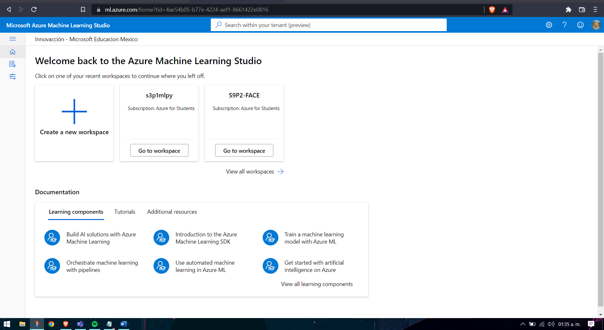

**2.-Ahora nos vamos a Compute y creamos un Compute instances (Le damos en New)**

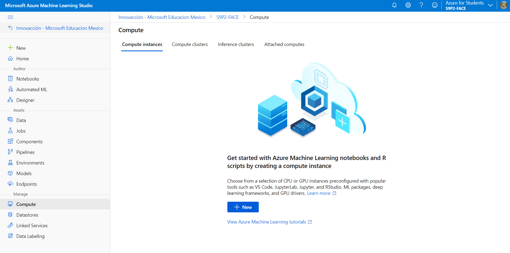

**3.-Le damos un nombre cualquiera y seleccionamos un modelo de computer instances y le damos en Create**

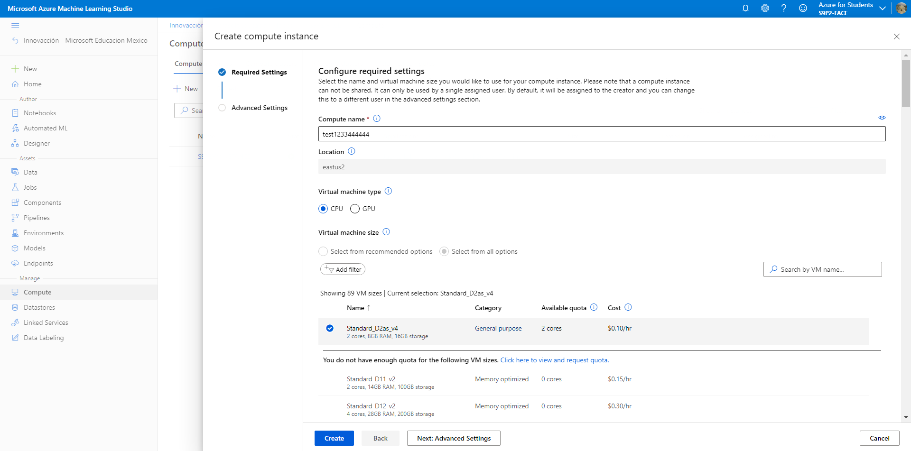

**4.-Ahora nos vamos a Notebooks y creamos un .ipynb**

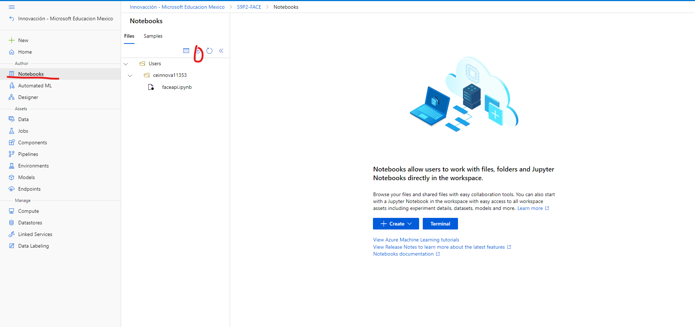

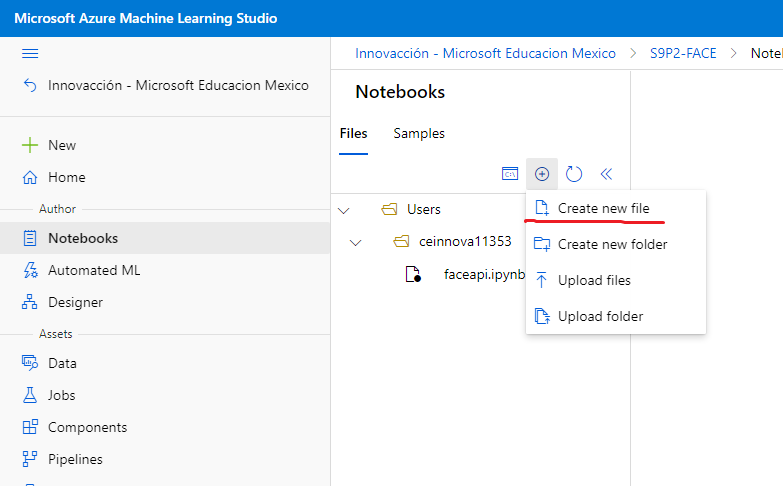

**5.-Le damos un nombre y escogemos el tipo de archivo**

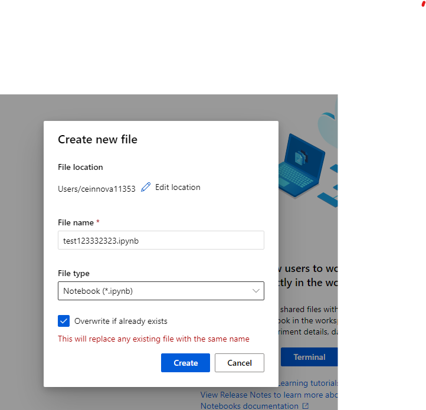

**6.-Ahora pegamos el script que en los requisitos te deje para que solamente copies y peges (CREDITOS: josejesusguzman) IMPORTANTE: para tener la subscription key, faceapiurl tendremos que irnos ahora a nuestro [Portal de Azure](https://portal.azure.com/#home) para la image-url solamente copiamos la url de una imagen**

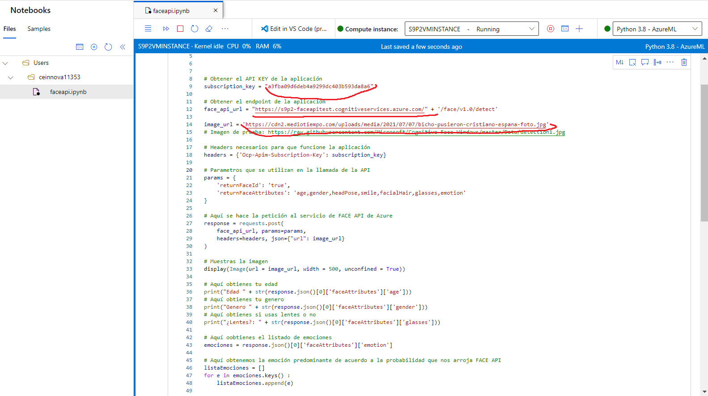

**7.-Ahora dentor de nuestro portal de azure buscamos FaceApi**

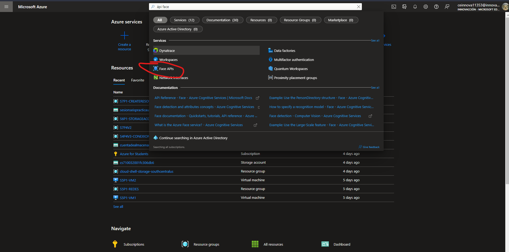

**8.-Le damos en create**

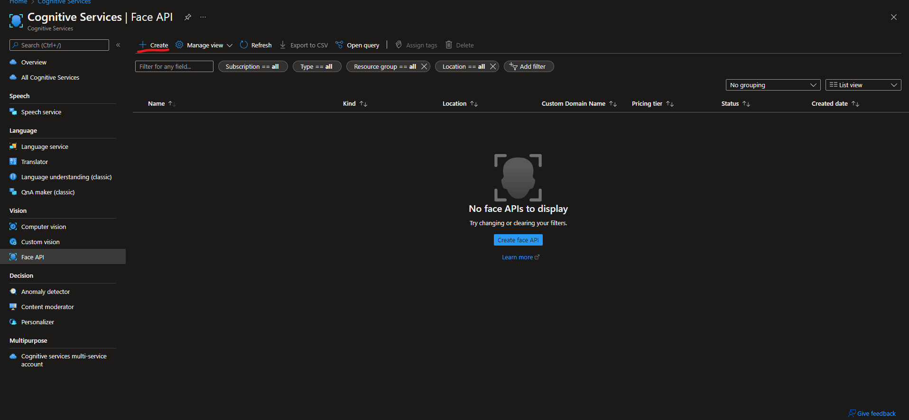

**9.-Le damos una suscripcion, un grupo de recursos, región, nombre y el tipo de precio, le daremos en revisar y en crear**

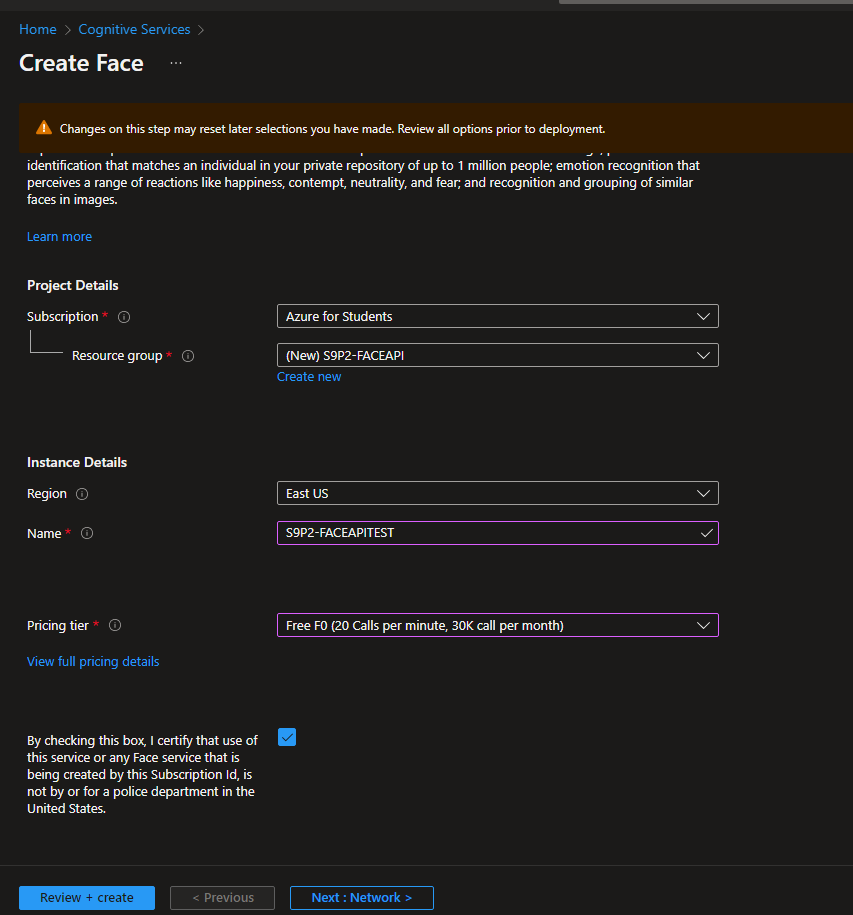

**10.-Nos vamos al recurso**

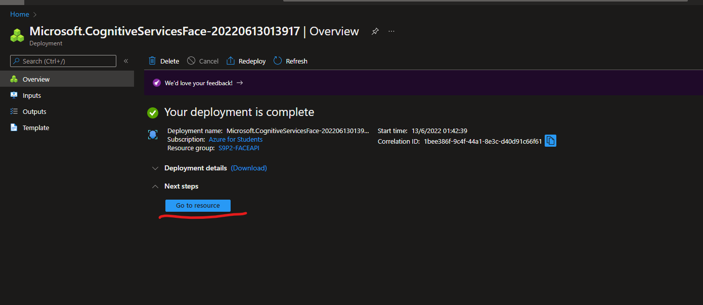

**11.-Ahora dentro del recurso nos vamos a Keys and Endpoint y copiamos la primera llave y el endpoint**

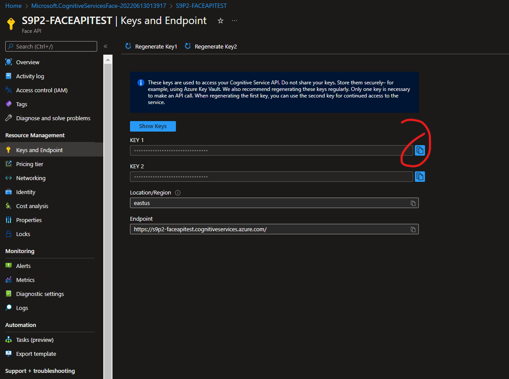

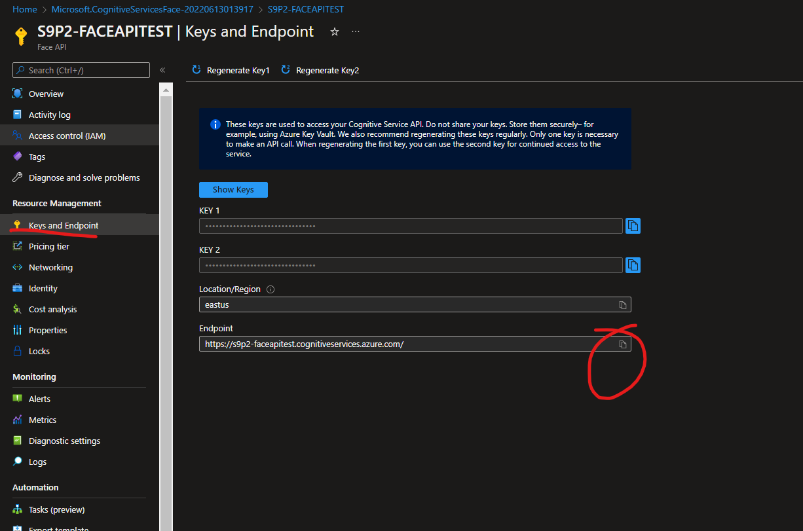

**12.-Ahora nos regremos a nuestro script de python y pegamos las llaves faltantes. En subscription key ponemos primera llave y en face_api_url ponemos el Endpoint (la imagen la sacamos de cualquier link que este subido en internet)**

